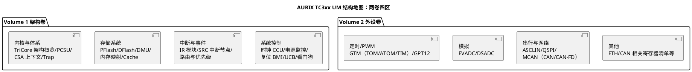

# 01-TC377-UM

> 一句话定位：给 AURIX TC3xx User Manual（TC377 的主手册）画一张"结构地图"——哪卷哪章管什么、按问题怎么反查章节、哪些章节是必读的"坑章节"，让你拿着几千页的手册不再从第 1 页啃起。
> 等级：L1 ｜ 前置：[站在巨人肩膀上-标准与文献怎么读](../../00-入门导读/01-站在巨人肩膀上-标准与文献怎么读.md)

TC377 是英飞凌 AURIX TC3xx 家族的派生型号（三核 TriCore 1.6.x、锁步可选、内置 GTM）。它的文档不是一本，而是一个**文档族**——UM（User Manual）讲机制、Data Sheet 讲参数、Errata 讲勘误、Application Note 讲示例。本篇聚焦 UM 的读法。

## 这份手册的结构地图

### 先分清文档族四件套

| 文档 | 定位 | 何时用 |
|---|---|---|
| AURIX TC3xx User Manual（Volume 1 架构 / Volume 2 外设） | 机制与寄存器：内核、存储、中断、时钟电源 + 全部外设模块 | 写驱动/排障主力 |
| TC37x Data Sheet | 本派生型号的规格：资源清单（模块实例数/频率/封装）、电气参数、引脚 | 选型、查参数、确认"这颗有没有这个外设" |
| Errata Sheet（AURIX TC3xx Errata） | 勘误：芯片已知的"规格之外"行为 | 立项第一周通读一遍，之后每月对版 |
| AURIX Training / Application Note（含 iLLD 用例） | 官方示例：EVADC 采样、GTM PWM 等课题式讲解 | 动工前搜一份对照 |

注意：**UM 是家族级的**，讲的是 TC3xx 家族的机制；TC377 具体有几个 CAN 节点、多大 Flash，一律以 Data Sheet 为准——"UM 讲怎么用，DS 讲有没有、有多少"。

### UM 两卷的章节地图

使用直觉：**架构卷是"房子的水电图"**（不通读不行，但只需读一次，之后当字典）；**外设卷是"房间说明书"**（按用到的模块逐间进，每间先读 functional description 再读寄存器表）。

## 按问题反查章节：问题 → 去处

读手册的正确姿势是"问题驱动"，常用问题路由表：

| 你遇到的问题 | 反查去处 | 库内配套笔记 |
|---|---|---|
| 主频怎么算出来的/外设时钟为何没跑 | Vol1 系统控制：CCU 时钟树（OSC/PLL/CCU）+ 外设时钟分频使能 | [CCU与时钟树](../../../02-芯片与体系结构/2-L2进阶/TC377平台/时钟系统/01-CCU与时钟树.md) |
| 中断不进/优先级不生效 | Vol1 中断与事件：SRC 模块、IR 路由、服务请求节点 | [SRC模块](../../../02-芯片与体系结构/2-L2进阶/TC377平台/中断系统/01-SRC模块.md) |
| Flash 擦写失败/扇区划分 | Vol1 存储系统：DMU、P/DFlash 扇区、页编程时序 | [PFlash与DFlash](../../../02-芯片与体系结构/2-L2进阶/TC377平台/存储器映射/01-PFlash与DFlash.md) |
| PWM 波形不对 | Vol2 GTM 章 + 官方 GTM 规范（TOM/ATOM 子模块） | [GTM架构概览](../../../02-芯片与体系结构/2-L2进阶/TC377平台/GTM/01-GTM架构概览.md) |
| 采样不稳/通道分组 | Vol2 EVADC 章：转换序列、门控、结果对齐 | [TC377-EVADC](../../../04-MCAL与外设驱动/2-L2进阶/Adc/02-TC377-EVADC.md) |
| 程序跑飞/复位后进不对的模式 | Vol1 BMI/引导头（BMHD0/1）、启动后入口 | [TC377-BMI与引导头](../../../02-芯片与体系结构/2-L2进阶/启动流程/01-TC377-BMI与引导头.md) |
| Trap 进了未知类 | Vol1 内核附录：Trap 分类（FCN/MRA/…）与 TIN | [TC377-Trap分类与TIN](../../../02-芯片与体系结构/3-L3高级/异常与Trap/01-TC377-Trap分类与TIN.md) |

> 注：Trap 分类的助记符缩写（FCN/MRA 等）以 TriCore Architecture Manual 为准，本文缩写为个人阅读速记。

反查的通用三步：**先索引页找章名 → 读该章 functional description（不碰寄存器）→ 最后查寄存器位域表**。多数问题在第二步就能定位机制，第三步只是核对位定义。

## 常见"坑章节"清单

这些章节不是难读，而是**不读必踩坑**：

1. **时钟与电源（Vol1 系统控制）**：EVRC/电源监控、上电复位阈值、PLL 锁定时间——量产低功耗问题（复位/欠压误动作）的源头多半在这章，画板与软件初始化顺序都依赖它；
2. **BMI 与 UCB（Vol1）**：引导模式字、UCB 里的 Flash 读写保护与调试口锁定——**配置错了会锁死芯片**，动 UCB 前必读，详见 [TC377-BMI与引导头](../../../02-芯片与体系结构/2-L2进阶/启动流程/01-TC377-BMI与引导头.md)；
3. **Errata Sheet**：独立于 UM 的"补丁文档"，列的是芯片实际行为与规格的偏差；版本要和芯片 Step（硅修订步进）对上，老 Errata 不覆盖新步进；
4. **GTM 章**：UM 只讲 GTM 与芯片的集成（时钟/中断/引脚），TOM/ATOM 内部机制要看 GTM-IP 规范本体——两级文档别混；
5. **Data Sheet 的电气参数附录**：IO 驱动能力、上升沿速率选择、Flash 擦写 endurance——驱动强度配错会引发 EMC 问题，软件里配 IO 的依据在这。

## 易错点与陷阱

1. **家族 UM ≠ 派生 DS**：在 UM 里看到的模块（如更多 CAN 节点、HSM），TC377 不一定有/不一定这个数量——资源问题一律回 DS；
2. **手册版本与芯片步进不核**：UM/Errata/DS 都随硅修订更新，先核版本再翻内容，引用时记录"UM 版本 + 章节"；
3. **从寄存器表读起**：一上来就啃寄存器位域，十天读不完一章——先机制（functional description）后寄存器，效率差十倍；
4. **忽略 iLLD 源码这个"活手册"**：iLLD 驱动是手册的代码化翻译，寄存器用法看 iLLD 实现最直观（[iLLD分层设计](../../../02-芯片与体系结构/2-L2进阶/TC377平台/资源与iLLD/01-iLLD分层设计.md)），但行为依据仍以 UM 为准；
5. **GTM 问题只在 UM 里找**：GTM 是独立 IP，深挖必须配 GTM-IP 规范，UM 章节只解决"接入"问题；
6. **拿 TC39x 的手册/例程直接用**：TC3xx 家族内派生差异大（核数、GTM 规模、外设实例），例程迁移先过 DS 核对模块实例号与基地址。

## 面试高频题

**Q：TC377 的文档族有哪些？各管什么？**
答：UM（家族级机制+寄存器，分架构卷/外设卷）、TC37x Data Sheet（本型号资源与电气参数）、Errata Sheet（勘误，按硅步进更新）、Training/AppNote 与 iLLD（示例与代码化参考）。原则：机制查 UM，有没有/有多少查 DS，异常行为查 Errata。

**Q：给你一个"外设时钟没跑"的问题，你在手册里怎么查？**
答：按问题路由进 Vol1 系统控制的 CCU 时钟树：先确认 OSC/PLL 源与锁定状态，再查该外设的时钟分频与门控位，最后核对引脚复用（AltFunc）是否选对输出——三步都在 UM 有明确章节，配合 [CCU与时钟树](../../../02-芯片与体系结构/2-L2进阶/TC377平台/时钟系统/01-CCU与时钟树.md) 的时钟树图核对。

**Q：UCB 是什么？为什么说它危险？**
答：User Configuration Block，Flash 里的一段配置区，存放 Flash 保护、HSM/调试口解锁条件、启动头等配置；写错（如误锁调试口）可能导致芯片无法再擦写/调试，量产前烧 UCB 必须走评审（见 [TC377-BMI与引导头](../../../02-芯片与体系结构/2-L2进阶/启动流程/01-TC377-BMI与引导头.md)）。

**Q：为什么读手册要"先机制后寄存器"？**
答：寄存器只是机制的控制面板——不懂 EVADC 的队列/门控机制，寄存器位域就是天书；先读 functional description 建立框图，寄存器表变成"填空题"，定位效率高一个量级。

## 延伸

- [站在巨人肩膀上-标准与文献怎么读](../../00-入门导读/01-站在巨人肩膀上-标准与文献怎么读.md)：本篇的上级地图（文献四梯队）
- [S32K-RM 读法](02-S32K-RM.md)：姊妹篇——另一颗主力芯片的手册地图，双平台对照
- [TC377平台笔记](../../../02-芯片与体系结构/2-L2进阶/TC377平台/README.md)：时钟/中断/存储/GTM/iLLD，五条线均已按问题拆好
- [iLLD分层设计](../../../02-芯片与体系结构/2-L2进阶/TC377平台/资源与iLLD/01-iLLD分层设计.md)：把 UM 寄存器翻译成代码的那层
- [Datasheet-vs-Reference-Manual](../../../03-硬件基础/1-L1基础/原理图阅读/数据手册阅读法/01-Datasheet-vs-Reference-Manual.md)：硬件视角的三层阅读法
