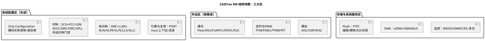

# 02-S32K-RM

> 一句话定位：给 S32K Reference Manual 画"结构地图"——S32K1xx 与 S32K3xx 两代 RM 的章节分区、按问题反查章节的路由表、以及 FTFC/时钟/WDOG 这些必踩坑章节，几千页手册按图索骥。
> 等级：L1 ｜ 前置：[站在巨人肩膀上-标准与文献怎么读](../../00-入门导读/01-站在巨人肩膀上-标准与文献怎么读.md)

S32K 家族跨两代：S32K1xx（Cortex-M4F 单核，FlexCAN/FTM/FTFC）与 S32K3xx（Cortex-M7 多核，MCAN/eMIOS/HSE-B）。两代的 RM 是**两本不同的书**（[内核与资源对比](../../../02-芯片与体系结构/1-L1基础/S32K平台/S32K1与S32K3对比/01-内核与资源对比.md)），但读法同构。本篇以 S32K1xx RM 为主、S32K3xx 差异单列。

## 这份手册的结构地图

### 文档族四件套（NXP 习惯）

| 文档 | 定位 | 何时用 |
|---|---|---|
| Reference Manual（RM） | 全部模块的机制与寄存器——S32K1xx 一本通，S32K3xx 另加 Safety Manual | 写驱动/排障主力 |
| Data Sheet | 资源清单、电气参数、封装与引脚（与 RM 分离） | 选型、查极限参数、核对"有没有" |
| Errata / Release Notes | 勘误与已知问题 | 立项先读，硅步进对版 |
| Application Note + S32 Design Studio 例程 | 课题式示例（低功耗、CAN、EEPROM 仿真等） | 动工前对照 |

### RM 章节分区：S32K1xx

推荐进攻顺序：**系统配置区当"序章"通读一遍**（约百页，建立时钟/低功耗/引脚三张全局图），外设区按任务逐模块进，存储与系统服务区按里程碑进（Flash 在做 NVM 时、WDOG 在做安全机制时）。

### S32K3xx RM 的差异

- 引脚复用从 PORT/SIM 拆分升级为 **SIUL2**；时钟从 SCG/PCC 变为 **MC_CGM/MC_ME**（模式驱动）；
- CAN 从 FlexCAN 换成 **MCAN**（基于 Bosch M_CAN），PWM 从 FTM 换成 **eMIOS**，ADC 触发链多出 **BCTU**；
- 新增 **HSE-B**（硬件安全引擎）与 **XRDC**（资源域控制），但 HSE 固件用法在独立的 HSE Firmware 文档，RM 只讲接口；
- 安全相关内容集中在独立的 **Safety Manual**——功能安全项目两本都要。

## 按问题反查章节：路由表

| 你遇到的问题 | 反查去处 | 库内配套笔记 |
|---|---|---|
| 外设寄存器读出来全 0/总线错误 | PCC：该外设时钟门控是否使能（S32K3：MC_ME 模式使能） | [SCG与PCC](../../../02-芯片与体系结构/1-L1基础/S32K平台/时钟系统/01-SCG与PCC.md) |
| 引脚不出波形 | PORT 章：mux 选择 + 方向/上下拉；再查 PCC 时钟 | [SIM复用配置](../../../02-芯片与体系结构/1-L1基础/S32K平台/时钟系统/02-SIM复用配置.md) |
| Flash 擦写失败 | FTFC 章：命令写序列、扇区/phrase 编程、编程期间取指限制 | [FTFC机制](../../../02-芯片与体系结构/1-L1基础/S32K平台/存储器与Flash/01-FTFC机制.md) |
| EEPROM 仿真容量/寿命不对 | FTFC 的 EEE 分区（DEPartition/EEESize）+ Data Sheet 耐久值 | [EEE模拟EEPROM](../../../02-芯片与体系结构/1-L1基础/S32K平台/存储器与Flash/02-EEE模拟EEPROM.md) |
| 低功耗电流超标 | SMC 模式章 + LLWU 唤醒源 + 时钟章的模块使能核对 | [S32K复位流程](../../../02-芯片与体系结构/2-L2进阶/启动流程/02-S32K复位流程.md) |
| 看门狗改不了配置 | WDOG 章：解锁序列（16-bit 两步写）与允许修改的窗口 | [S32K-WDOG](../../../04-MCAL与外设驱动/2-L2进阶/Wdg/03-S32K-WDOG.md) |
| 上电后从哪跑起来 | 复位与启动章：向量表、FSEC/FTFA 选项字节、启动文件衔接 | [S32K启动代码分析](../../../01-编程语言/2-L2进阶/汇编基础/启动代码阅读/02-S32K启动代码分析.md) |

## 常见"坑章节"清单

1. **时钟链（SCG + PCC + SIM）**：S32K 的经典坑是"外设没使能时钟就去写寄存器"——先 PCC 开门控再碰外设；时钟源切换（SPLL/FIRC/SIRC）的运行中切换约束也要读细，详见 [SCG与PCC](../../../02-芯片与体系结构/1-L1基础/S32K平台/时钟系统/01-SCG与PCC.md)；
2. **FTFC/EEE 分区**：EEE 分区配置影响 Flash 布局且量产改分区要重新刷写；编程有 phrase/section 两种模式，用错会报保护错误——动 Flash 前整章细读；
3. **WDOG**：默认上电就使能（Boot 配置决定），喂狗/改配置有严格解锁序列与执行窗口，LPO 时钟依赖要确认；量产死机案例高发地；
4. **低功耗模式（SMC）**：各模式允许的时钟频率与外设状态不同，唤醒源要在 LLWU 里逐个使能——"睡得着醒不来"多半是这张表没对齐；
5. **Errata 与硅步进**：同一 S32K144 有多个硅版本，Errata 按 "1N83H" 之类的标记列适用范围，查问题先对步进。

## 易错点与陷阱

1. **两代 RM 混用**：拿 S32K1xx 的 FTM/PORT 知识去配 S32K3xx（eMIOS/SIUL2）——模块名和寄存器全变了，先确认手上的芯片与 RM 对版；
2. **RM 查电气参数**：驱动能力、上升沿控制、IO 电压域在 Data Sheet，RM 里没有——两个文档各查各的，别在 RM 里白找；
3. **跳过 Chip Configuration 章**：每个模块的实例数、通道差在这章的表里，不看它就去抄例程，容易用了本型号没有的通道；
4. **例程（SDK/RTD demo）当规范**：例程是"能跑的参考"，不保证是"最优/合规"（时钟配置、低功耗路径常是简化版），关键配置项回 RM 条目核对；
5. **HSE-B 的文档层级**：S32K3xx 的 RM 只覆盖 HSE 的主机接口，密钥管理、固件 API 在独立文档——安全功能开发要找全文档链；
6. **忽视 FTFC 的取指限制**：对 Flash 编程期间又从同一 bank 取指会 stall/错误，擦写例程须放 RAM 或别的 bank 执行（链接脚本配合）。

## 面试高频题

**Q：S32K 上访问外设寄存器全 0 或触发总线错误，你先查什么？**
答：先查 PCC（S32K3xx 为 MC_ME/MC_CGM）里该外设的时钟门控是否使能——S32K 外设默认无时钟，先开时钟再碰寄存器；其次查 PORT 复用与引脚方向；再查低功耗模式是否允许该外设工作。路线见 [SCG与PCC](../../../02-芯片与体系结构/1-L1基础/S32K平台/时钟系统/01-SCG与PCC.md)。

**Q：FTFC 的 EEE 仿真 EEPROM 是怎么回事？改分区要注意什么？**
答：FlexRAM + Flash 备份区模拟 EEPROM：DEPartition 划分 EEE 备份区大小，写入 FlexRAM 由硬件自动搬移到备份区，记录表项做磨损均衡；分区影响整体 Flash 布局，量产改分区意味着重新刷全片，且耐久度按 Data Sheet 的 EEE 循环数评估（[EEE模拟EEPROM](../../../02-芯片与体系结构/1-L1基础/S32K平台/存储器与Flash/02-EEE模拟EEPROM.md)）。

**Q：S32K1 和 S32K3 的 RM 结构主要差在哪？**
答：内核 M4F→M7 多核；时钟 SCG/PCC→MC_CGM/MC_ME；引脚 PORT→SIUL2；CAN FlexCAN→MCAN；PWM FTM→eMIOS；新增 HSE-B/XRDC/BCTU，安全内容另有 Safety Manual——两代是两本书，对版再用。

**Q：看门狗配置改不动，为什么？**
答：S32K WDOG 有解锁序列（向 WDOG_UNLOCK 依序写两个 16-bit 值），且解锁后只有约 20 个总线周期的窗口；此外部分位只在上电后首次解锁前可改。答出"解锁序列 + 窗口 + 时钟 LPO 依赖"三要点即可。

## 延伸

- [站在巨人肩膀上-标准与文献怎么读](../../00-入门导读/01-站在巨人肩膀上-标准与文献怎么读.md)：本篇的上级地图（文献四梯队）
- [TC377-UM 读法](01-TC377-UM.md)：姊妹篇——TriCore 侧手册地图，双平台对照读效率更高
- [S32K平台笔记](../../../02-芯片与体系结构/1-L1基础/S32K平台/README.md)：时钟/Flash/对比三条线的库内展开
- [S32K启动代码分析](../../../01-编程语言/2-L2进阶/汇编基础/启动代码阅读/02-S32K启动代码分析.md)：把 RM 的复位章落到汇编与链接脚本
- [Datasheet-vs-Reference-Manual](../../../03-硬件基础/1-L1基础/原理图阅读/数据手册阅读法/01-Datasheet-vs-Reference-Manual.md)：三层阅读法的硬件视角
