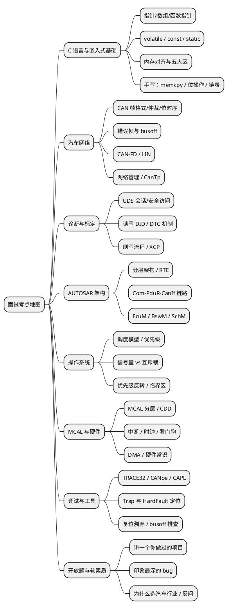

# 01-面试是知识库的期末考试

> 一句话定位：面试不是新知识，而是把 01~13 区串起来的压力测试——本篇给你考点地图、"背题 vs 理解"的判卷口径和 STAR 答题模板，让知识库的每一篇都能在面试场上变现。
> 等级：L1 ｜ 前置：无

## 面试是一场开卷却限时的人生考试

把知识库想成四年大学：01~13 区是十四门课，14 区就是期末考试周。这门考试有三个残酷特性：

1. **考的是网络不是点**：面试官不会只问"volatile 是什么"，他会从 volatile 一路追问到"编译器优化了你的寄存器读吗→Duff 器件那种场景怎么防→中断服务里为什么也要防重入"。任何孤立背下来的知识点，在第二层追问时就会露馅——因为追问走的是知识之间的**边**，而知识库从第一天起就是按"篇间互链"搭的；
2. **考的是表达不是默写**：考场上没人给你打分你的代码，但面试官在给你打分你的**叙事**——能不能在 90 秒里把 CAN 仲裁讲成一个故事，决定了你是"背过 CAN"还是"懂 CAN"；
3. **考的是诚实不是全能**：说"这个我没实际调过，但我知道去哪查"远好于硬编一个错误答案。汽车行业面试官几乎都是干活的工程师，一眼能看穿编造。

所以本区的用法和其它区相反：**不是"学新东西"，而是"用面试的视角把旧东西再过一遍"**。每一道题后面都有一条"出处回链"指回 01~13 区的对应篇——答不上的题，就是知识库地图上你的空洞。

## 面试考点地图：八大领域 × 高频题型



读图口径：**左侧五个领域（C/网络/诊断/AUTOSAR/OS）是 BSW/CDD 岗的必考主线**，右侧三个是加分项与区分度所在。每场 1 小时的技术面，通常是"两大主领域深挖 + 一道手写题 + 一道开放项目题"的组合拳——对应本区题库的分篇结构。

### 考点与知识库的映射

| 考点领域 | 主考区 | 本区对应篇 |
|---|---|---|
| C 语言与嵌入式基础 | 01-编程语言 | [01-C语言与嵌入式基础](../2-L2进阶/汽车电子面试题库/01-C语言与嵌入式基础.md) |
| 汽车网络 CAN/LIN | 05-汽车网络通讯 | [02-汽车网络CAN与LIN](../2-L2进阶/汽车电子面试题库/02-汽车网络CAN与LIN.md) |
| 诊断 UDS/标定 | 06-诊断与标定 | [03-诊断UDS与标定](../2-L2进阶/汽车电子面试题库/03-诊断UDS与标定.md) |
| AUTOSAR 架构 | 07-AUTOSAR架构 | [04-AUTOSAR架构与BSW](../2-L2进阶/汽车电子面试题库/04-AUTOSAR架构与BSW.md) |
| 操作系统 | 08-操作系统 | [05-操作系统与RTOS](../2-L2进阶/汽车电子面试题库/05-操作系统与RTOS.md) |
| MCAL 与硬件 | 02/03/04 区 | [06-MCAL外设与硬件](../2-L2进阶/汽车电子面试题库/06-MCAL外设与硬件.md) |
| 调试工具与开放题 | 09/12 区 | [07-调试工具与开放问题](../2-L2进阶/汽车电子面试题库/07-调试工具与开放问题.md) |
| 手写代码 | 01 区算法篇 | [手写代码题](../1-L1基础/手写代码题/README.md) |

## "背题"与"理解"的分界线

题库背 500 道，不如真懂 50 道。判卷口径只有一条：**能讲清 why 的题才算会**。三个层次自检：

| 层次 | 表现 | 面试官的下一步 |
|---|---|---|
| 背过 | "CAN 仲裁是 ID 小的优先。" | "为什么 ID 小就优先？"——答不上，止步于此 |
| 懂了 | "显性位 0 会覆盖隐性 1，ID 小的节点先发 0，发现总线还是 1 就知道自己输了，主动退出。" | "那错误帧是怎么检出来的？"——继续追问 |
| 用过 | "我们项目上遇到过两个节点 ID 配重了，总线一直在打架，CANoe 里看到满屏错误帧……" | 面试官开始点头，话题转向你的项目 |

三种对话的分水岭不在答案本身，而在**追问第二层时你还在不在**。所以刷题库时给自己立个规矩：

- 每题答完，自己往下**再问一层 why**（题库每题的"出处回链"就是第二层答案的所在）；
- 回链的篇读不懂，说明该回炉对应区，别在题库死磕；
- 手写题必须**真的在纸上写过三遍**——肌肉记忆会在白板紧张时救你。

## 自我介绍与项目介绍：STAR 结构化模板

开放题才是拉开差距的地方，而它们全部可以用一个骨架接住。

### 自我介绍（90 秒版）

```
我是谁（10s）：X 年汽车电子 BSW/CDD 方向，主战场 TC377 + S32K 双平台。
我做过什么（50s）：最近一个项目里，我负责 XX 域 XX ECU 的 XX 模块——
  遇到什么问题（S）、我的任务是什么（T）、我怎么做的（A）、结果如何（R）。
我擅长什么（20s）：CAN/诊断/OS 三条主线，能独立从 ARXML 配置到 TRACE32 排障闭环。
我为什么在这里（10s）：贵司的 XX 方向和我的积累重合度高，我想往 XX 深处走。
```

要点：**有数字，有平台，有闭环**。"解决了总线偶发 busoff"不如"把误码率从 1e-5 降到 1e-9，复现到定位花了两天"。

### 项目介绍（STAR 展开版）

| 环节 | 说人话的问句 | 写作提示 |
|---|---|---|
| S 情境 | "当时是什么背景？" | 项目规模、你的角色、约束（时间/资源/标准） |
| T 任务 | "分到你头上的是什么？" | 具体到模块与指标，别把团队目标说成个人目标 |
| A 行动 | "你具体做了什么？" | 技术选型的 why、踩的坑、和谁协作——**这是得分主体** |
| R 结果 | "最后怎么样了？" | 量化结果 + 沉淀（文档/工具/方法论） |

弹药库不用现编：[12-项目实战/项目复盘](../../12-项目实战/3-L3高级/项目复盘/README.md)的复盘档案就是 STAR 的原始素材，面试前把最近一个项目的复盘读三遍即可。

### 高频开放题清单（题库 07 篇全量展开）

- 讲一个你最有成就感的项目（用 STAR）；
- 讲一个印象最深的 bug，怎么定位的（考察调试方法论，回链 09 区）；
- 和同事方案冲突怎么办（考察协作，答"数据说话 + 分级上报"）；
- 你的缺点是什么（答真实但不致命的，附改进行动）；
- 反问环节问什么（问团队技术栈与培养机制，**别问薪资加班**——那是 HR 环节的事）。

## 本区地图

| 带 | 子目录 | 一句话 |
|---|---|---|
| 00-入门导读 | （本篇） | 考点地图 + 判卷口径 + STAR 模板 |
| 1-L1基础 | 手写代码题/ | memcpy/strcpy、位操作、链表反转——白板三连 |
| 2-L2进阶 | 汽车电子面试题库/ | 七大领域分篇问答集，每题带答案与出处回链 |
| 2-L2进阶 | 职业发展/ | 路径图、技能雷达、跳槽晋升取舍、行业观察 |

本区不设 3-L3 带：面试与职业内容按"检索密度"组织，不按深水区递进——需要深挖时直接跳对应技术区（01~13）。

## 下一步读什么

- 技术面三周后：先刷 [题库索引](../2-L2进阶/汽车电子面试题库/00-题库索引.md)，按目标岗位勾选领域篇，逐题回链验证；
- 笔试/白板在即：直奔 [手写代码题](../1-L1基础/手写代码题/README.md)，三篇每篇纸上写三遍；
- 看机会/评晋升：从 [方向与路径](../2-L2进阶/职业发展/01-方向与路径.md) 入口进职业发展线；
- 完整阅读顺序见本区 [README 入门坡道](../README.md)。

---

维护约定：笔记命名 `序号-主题.md`；真实截图放 `_images/`；流程/时序/状态/架构图用 PlantUML 内嵌正文，规范见 [图表规范与模板](../../00-总览/图表规范与模板.md)。
