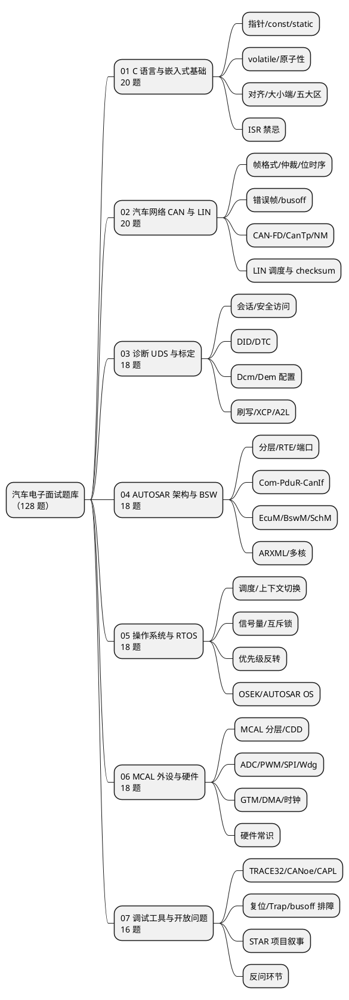

# 00-题库索引

> 一句话定位：题库的总目录与使用说明书——先看"考什么、刷哪篇、怎么刷"，再按目标岗位勾选领域篇逐题回链验证，别从头背到尾。
> 等级：L2 ｜ 前置：[面试是知识库的期末考试](../../00-入门导读/01-面试是知识库的期末考试.md)

## 太长不看

七大领域分篇共 **128 题**，统一 `**Q：…**` / `答：…` 格式，**每题必带答案**，答案后附"出处"回链指回知识库对应篇。刷法三步：① 按岗位勾篇目 → ② 每题**先自答再看答案** → ③ 答不上的顺着回链回炉对应区。题库不新造知识，只做知识库的检索索引——背题库不如读回链。

## 七大领域地图

读图口径：左列（01/02/04/05）是 BSW 岗的必考主线，03 是诊断岗主场，06 是 CDD 岗主场，07 是所有岗位的收尾环节——典型 1 小时技术面 = "两大主领域深挖 + 一道手写题 + 一道开放项目题"。

## 每篇题量与难度分布

| 篇目 | 总题数 | 基础 | 进阶 | 区分度 | 主考区 |
|---|---|---|---|---|---|
| [01-C语言与嵌入式基础](01-C语言与嵌入式基础.md) | 20 | 8 | 7 | 5 | 01 区 |
| [02-汽车网络CAN与LIN](02-汽车网络CAN与LIN.md) | 20 | 8 | 7 | 5 | 05 区 |
| [03-诊断UDS与标定](03-诊断UDS与标定.md) | 18 | 8 | 7 | 3 | 06 区 |
| [04-AUTOSAR架构与BSW](04-AUTOSAR架构与BSW.md) | 18 | 8 | 7 | 3 | 07 区 |
| [05-操作系统与RTOS](05-操作系统与RTOS.md) | 18 | 8 | 6 | 4 | 08 区 |
| [06-MCAL外设与硬件](06-MCAL外设与硬件.md) | 18 | 8 | 7 | 3 | 02/03/04 区 |
| [07-调试工具与开放问题](07-调试工具与开放问题.md) | 16 | 6（工具） | 5（排障） | 5（开放） | 09/12 区 |
| **合计** | **128** | **54** | **46** | **28** | — |

分层含义：**基础题**答错直接出局；**进阶题**拉开"背过 vs 懂了"的差距；**区分度题**是案例叙事题，答好等于把面试变成你的主场。

## 篇目总表（一句话定位）

| 篇目 | 题域 | 一句话 |
|---|---|---|
| [01-C语言与嵌入式基础](01-C语言与嵌入式基础.md) | 指针/volatile/内存/中断 | 笔试第一关：static、volatile、大小端、对齐、栈堆、中断里的禁忌 |
| [02-汽车网络CAN与LIN](02-汽车网络CAN与LIN.md) | CAN/CAN-FD/LIN/NM/CanTp | BSW 岗必考：帧格式、仲裁、位时序、busoff、NM 状态机、DBC |
| [03-诊断UDS与标定](03-诊断UDS与标定.md) | UDS/Dcm/Dem/XCP/刷写 | 会话、安全访问、读写 DID、DTC 机制、刷写流程、A2L |
| [04-AUTOSAR架构与BSW](04-AUTOSAR架构与BSW.md) | 分层/RTE/BSW 栈 | 分层架构、RTE、Com-PduR-CanIf、EcuM/BswM、ARXML |
| [05-操作系统与RTOS](05-操作系统与RTOS.md) | 调度/同步/OSEK | 调度模型、优先级反转、临界区、OSEK 与 AUTOSAR OS |
| [06-MCAL外设与硬件](06-MCAL外设与硬件.md) | MCAL/CDD/DMA/硬件 | MCAL 分层、CDD、看门狗、DMA、时钟、上下拉 |
| [07-调试工具与开放问题](07-调试工具与开放问题.md) | 工具/排障/软素质 | TRACE32/CANoe/CAPL、Trap 定位、项目叙事与反问 |

## 使用方法（先自测再翻答案）

1. **第一遍盲测**（每篇 40~60 分钟）：盖住答案逐题口述，录音或让同伴判卷；说不出的题打标记；
2. **第二遍回链**：只处理标记题——读"出处"指向的知识库篇，把答案的因为所以讲成故事，再合卷复述；
3. **第三遍抽查**（面试前一天）：每篇随机抽 3 题 30 秒速答，卡壳的临阵磨枪；
4. **手写题并行**：[手写代码题](../../1-L1基础/手写代码题/README.md) 三篇每篇纸上写三遍，白板环节靠肌肉记忆。

### 刷题节奏参考

| 距面试 | 动作 |
|---|---|
| 3 周 | 全量盲测一遍，建立"空洞清单" |
| 2 周 | 按空洞清单回链回炉对应技术区 |
| 1 周 | 目标岗位的必刷篇二刷 + 手写题三遍 |
| 前 1 天 | 每篇抽 3 题 + 自我介绍/项目 STAR 过一遍 |

## 按岗位勾选

| 目标岗位 | 必刷 | 加分 |
|---|---|---|
| BSW 集成工程师 | 02、04、05 | 01、03、07 |
| 诊断/标定工程师 | 03、02、04 | 07、05 |
| CDD/驱动工程师 | 06、01、05 | 02、07 |
| 应用层/SWC 工程师 | 04、05、01 | 02、03 |
| 测试/工具工程师 | 07、03、02 | 01、05 |

## 刷题纪律（三问过滤法）

1. **第一层（背过没有）**：合上答案能不能说出主干？说不出 → 标记，隔天重刷；
2. **第二层（懂 why 没有）**：顺着"出处"读对应篇，能不能把答案的每个因为所以讲成故事？讲不成 → 回炉该区，别死磕题库；
3. **第三层（用过没有）**：能不能挂上自己项目里的一个实例？挂不上 → 记一句"我配置过但没深究"，面试时诚实交代——判卷口径见 [导读](../../00-入门导读/01-面试是知识库的期末考试.md)。

## 答题模板

- **概念题**：一句定义 + 一个机制 + 一个项目实例（30 秒）；
- **对比题**：先各一句话定位，再给一张两三行的对比表，最后说"我们项目选 X 因为 Y"；
- **场景排障题**：先说定位路径（分层、先硬后软、先总线后应用），再给最可能的三个根因——展示的是方法论不是答案。

---

维护约定：笔记命名 `序号-主题.md`；真实截图放 `_images/`；流程/时序/状态/架构图用 PlantUML 内嵌正文，规范见 [图表规范与模板](../../../00-总览/图表规范与模板.md)。
