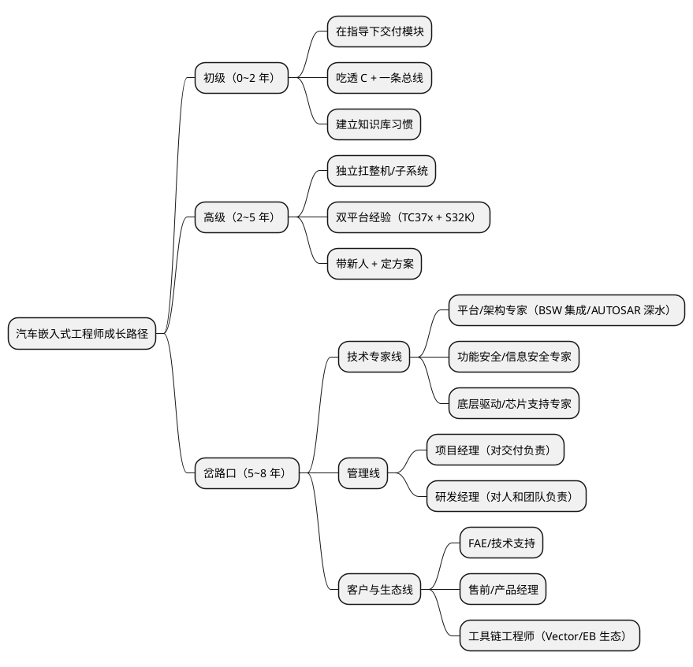

# 01-方向与路径

> 一句话定位：技术主线之外的人生选题第一篇——把"初级→高级→专家/管理岔路"画成一张图，配三条细分赛道与三个自问，让每一年都有明确的下一步而不是被推着走。
> 等级：L2 ｜ 前置：[面试是知识库的期末考试](../../00-入门导读/01-面试是知识库的期末考试.md)

## 太长不看

汽车嵌入式工程师的成长不是一条直线，而是"两段楼梯 + 一个岔路口"：前 5 年爬基本功（能独立交付模块→能扛整机软件），之后在**技术专家线 / 管理线 / 客户与生态线**里选主路。选路的依据不是薪资标题，是三个问题：你要什么、你凭什么、你愿意放弃什么。本篇给地图与判据，不给标准答案——路径没有对错，只有匹配。

## 核心概念：成长路径岔路图

三段的核心差异不是年限而是**产出物**：初级交付代码、高级交付子系统、岔路口之后交付"判断"——技术判断、资源判断或客户判断。

## 详解

### 三阶段的能力标志

| 阶段 | 别人怎么描述你 | 标志性产出 | 本库对应 |
|---|---|---|---|
| 初级 | "交给他一个模块，能按期出来" | 模块代码 + 问题单闭环 | 01~05 区地基 + [手写代码题](../../1-L1基础/手写代码题/README.md) |
| 高级 | "这块出问题找他，他总有思路" | 整机软件交付 + 排障方法论 | 06~09 区 + [调试方法论](../../../09-调试与测试/3-L3高级/调试方法论/README.md) |
| 专家/管理 | "听他的，他定过同类项目的方向" | 架构决策 / 团队产出 | 11~13 区 + [项目复盘](../../../12-项目实战/3-L3高级/项目复盘/README.md) |

### 三条岔路的对照表

| 维度 | 技术专家线 | 管理线 | 客户与生态线 |
|---|---|---|---|
| 每天的活 | 评审方案、啃硬骨头、定规范 | 排兵布阵、向上汇报、跨部门协调 | 见客户、讲方案、搭 demo |
| 核心资产 | 技术判断力 + 行业口碑 | 团队信任 + 项目交付记录 | 客户关系 + 表达与情商 |
| 天花板 | 首席/架构师（金字塔尖窄） | 总监/GM（坑位有限） | 售前总监/产品负责人 |
| 主要风险 | 被质疑"只会技术" | 技术钝化、心累 | 技术深度不足被新人替代 |
| 适合的人 | 能忍受长期钻研、享受解谜 | 愿意背锅、愿意花时间在人上 | 喜欢变化、擅长沟通 |

### 汽车电子细分赛道地图

选线之前先选"道"——同为嵌入式，赛道决定了日常与天花板：

- **BSW/平台集成**：AUTOSAR 配置与集成，需求量最大、供应商/Tier1 主力岗；
- **诊断与标定**：协议密集、和客户交互多，天然贴近客户线；
- **CDD/驱动**：贴芯片、贴硬件，转型芯片厂支持岗最顺；
- **应用层 SWC/算法**：控制策略为王（动力/底盘），偏主机厂与算法公司；
- **测试与工具**：自动化测试、CI、CAPL/Python 工具链，向 DevOps 延伸；
- **功能安全/信息安全**：跨模块、文档与流程重，专家线的黄金赛道（[11 区](../../../11-功能安全与信息安全/README.md)）。

### 怎么选：三问自检

1. **要什么**——排序列出前三位（技术深度/收入/稳定/影响力/生活平衡），诚实排，别排"应该要的"；
2. **凭什么**——对照上一节的标志性产出，你现在能拿出哪一档的证据（复盘档案、架构决策记录、客户感谢信）？
3. **放弃什么**——专家线放弃"管人带来的权力感"，管理线放弃"亲手解谜的快感"，客户线放弃"整块时间的深度"。

三问答完仍纠结时，用"可逆性"裁决：选错哪条路更容易回头？多数人的答案：从管理回技术难、从技术转管理随时可以——所以拿不准时**先把技术做到高级再岔**。

## 易错点与常见挂点

1. **把"会配工具"当护城河**——DaVinci/Tresos 谁都能学会，护城河是"配置背后的 why"（SWS 与原理），工具是方向盘不是发动机；
2. **盲目追新不打地基**——AP/SOA/大模型很热，但 0~3 年的溢价全在 C/总线/RTOS 地基上，新东西是地基之上的放大器；
3. **只在一种公司语境里成长**——主机厂（需求方视角）、Tier1（交付方视角）、芯片厂（支持方视角）对同一技术的看法完全不同，有机会换位一次，认知升一档；
4. **把专家线误当"不用碰人"**——专家的方案要说服一屋子人，沟通密度不比管理低，只是对象换成技术论证；
5. **在还不是高级时提前转管理**——底下人一问技术就露怯，管理权威立不住；行业惯例：先做到"离开你项目会疼"再谈带人；
6. **忽视英语与写作**——SWS/规范/跨国邮件全是英文，晋升答辩与专利靠写作；这两项是所有线路的公共必修课。

## 灵魂三问（自问或被问）

**Q：你未来三年的方向是什么？**
答：给出"赛道 + 线路 + 里程碑"三件套，例如："继续 BSW/平台方向，三年内从模块负责做到整机集成负责，拿下功能安全项目经验（正在系统读 [11 区](../../../11-功能安全与信息安全/README.md)）"——具体、可验证、和目标岗位强相关；空喊"深耕技术"是负分答案。

**Q：技术专家和管理，你会怎么选？**
答：先讲判据再讲倾向："我的判断是先技术后管理——30 岁前把技术做到团队前 20%，因为管理的可信度来自技术判断力；如果那时团队需要且我证明了自己能把新人带出来，再考虑转管理。"体现的是"有思考、不站死队"。

**Q：想去主机厂还是 Tier1？**
答：对比口径：主机厂=需求定义视角、平台化、节奏慢决策链长；Tier1=交付压力、全栈接触、成长快；芯片厂=技术纵深、客户面广。答案要点是"我现阶段更需要 X 视角，所以选 Y"——把选择讲成职业设计而不是"钱多/轻松"。

## 延伸

- 全局学习节奏：[00-总览/学习路线图](../../../00-总览/学习路线图.md)——本篇岔路图的技术侧底图；
- 用什么证明你到了哪一档：[02-技能雷达与成长复盘](02-技能雷达与成长复盘.md)（下一篇）；
- 里程碑素材从哪来：[12 区/项目复盘](../../../12-项目实战/3-L3高级/项目复盘/README.md) 与 [00-复盘模板](../../../12-项目实战/3-L3高级/项目复盘/00-复盘模板.md)；
- 行业往哪走、赛道怎么押：[04-行业观察-新能源与域控](04-行业观察-新能源与域控.md)；
- 面试时怎么把路径讲给面试官：[07-调试工具与开放问题](../汽车电子面试题库/07-调试工具与开放问题.md) 开放题部分。

---

维护约定：笔记命名 `序号-主题.md`；真实截图放 `_images/`；流程/时序/状态/架构图用 PlantUML 内嵌正文，规范见 [图表规范与模板](../../../00-总览/图表规范与模板.md)。
