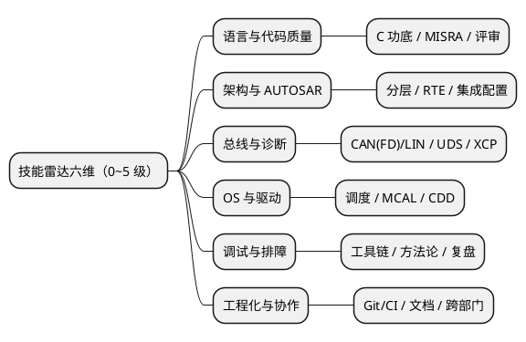

# 02-技能雷达与成长复盘

> 一句话定位：把"我成长了"变成可量化证据——六维技能雷达定义"强"的刻度，年度复盘四问把一年的活儿变成晋升答辩与面试的弹药库。
> 等级：L2 ｜ 前置：[01-方向与路径](01-方向与路径.md)

## 太长不看

技能雷达 = 六个维度 × 0~5 级刻度，每格分数必须挂一个证据（项目/问题单/复盘），无证据的分数不算数；成长复盘 = 每年年底用四问（做成什么/搞砸什么/学到什么/明年押什么）把散落的活儿收敛成一页纸。两者合起来回答同一个问题：**"你凭什么说你变强了？"**——晋升答辩、面试自我介绍、跳槽简历，用的都是这份底稿。

## 核心概念：六维技能雷达

### 0~5 级刻度定义（每级都要有证据）

| 级别 | 定义 | 证据示例 |
|---|---|---|
| 0 听说过 | 知道名词，没上手 | —— |
| 1 用过 | 在别人搭好的框架里填过 | 在既有工程里加过一个信号 |
| 2 会做 | 独立完成标准任务 | 独立配通一条 Com→CanIf 链路 |
| 3 能扛 | 非标问题能自己定位闭环 | 独立闭环一个 busoff/Trap 问题单 |
| 4 能定方案 | 在多个方案间做选择并负责 | 选定刷写分区方案并落地 |
| 5 能教能立规 | 出方法论、被团队复用 | 写团队规范/模板，带出新人 |

评分纪律：**自评降一档，同行评一档**；3 分以上必须能讲出一个 15 分钟的完整故事（STAR）。

## 详解

### 第一步：画雷达——三个动作

1. **定维**：六维是默认框架，可按赛道增删（功能安全岗加"26262 与安全机制"维，测试岗加"自动化与 CI"维）；
2. **打分挂证据**：每个格子后面写一个真实证据链接（知识库笔记路径、问题单号、复盘篇名），写不出的按 0~1 计；
3. **找型**：雷达形状即你的类型——"尖刺型"（一维独高）适合专家线打底，"圆润型"（无明显短板）适合集成/管理线。故意留一两个低分位没关系，**全维均匀=没有记忆点**。

### 第二步：年度复盘——四问一页纸

| 问题 | 写什么 | 长度 |
|---|---|---|
| 做成了什么 | 3 件事，每件带数字（周期/缺陷率/复现时长） | 各 2 行 |
| 搞砸了什么 | 1~2 件事，根因 + 改进动作 | 各 3 行 |
| 学到了什么 | 沉淀了几篇笔记/复盘/规范，分别回链 | 2 行 |
| 明年押什么 | 一个主攻维度（雷达上要升的那格）+ 一个放弃项 | 2 行 |

模板对齐 12 区的 [00-复盘模板](../../../12-项目实战/3-L3高级/项目复盘/00-复盘模板.md)——项目复盘按项目做，年度复盘按人做，同一套骨架。

### 第三步：证据库——把过程变资产

三样东西日常就要攒，年底才拼得出来：

- **问题单**：每个闭环的 bug 按"一坑一档"记（[09 区模板](../../../09-调试与测试/2-L2进阶/踩坑案例库/00-一坑一档模板.md)），它是排障维度的全部证据；
- **复盘**：项目节点（A 样/B 样/SOP）各一篇，写进 [12 区项目复盘](../../../12-项目实战/3-L3高级/项目复盘/README.md)；
- **知识库笔记**：学到的新东西当周落盘——本知识库的每一篇就是雷达"学到了什么"的实体化。

### 复盘的复利：三处变现

1. **晋升答辩**：答辩材料 = 年度复盘 ×2 + 雷达对比图（去年 vs 今年），评委要看的就是"刻度变化的证据"；
2. **面试自我介绍**：90 秒版里的"数字与闭环"，全部来自复盘的"做成了什么"；
3. **跳槽定价**：简历里每一条"独立完成 X"都能翻出对应复盘，背调与追问不慌。

## 易错点与常见挂点

1. **自评虚高**——"精通 CAN"被追问三连（仲裁为什么 ID 小优先→错误帧怎么发→busoff 恢复策略）当场击穿；对照 [题库索引](../汽车电子面试题库/00-题库索引.md) 盲测一次，能全答对再写"精通"；
2. **只记成功不记坑**——搞砸的事才是排障维度的养料；没有失败记录的复盘是宣传稿不是复盘；
3. **复盘写成流水账**——"参与了 XX 项目，负责 XX 模块"没有 why 与数字，等于没写；四问里最值钱的是"根因"和"放弃项"；
4. **雷达一年不重画**——维度和分数都不更新，成长可视为停滞；正确做法是每年固定一天（岁末或司龄日）重画并 diff；
5. **把培训当成长**——上课/拿证只是输入，雷达只认输出（做成的项目、闭环的问题单、被复用的规范）；
6. **六维全是 3 分**——看似全能实则无锋；职业中期至少要有一维 4 分以上，那才是你的"名字前面的定语"。

## 灵魂三问（自问或被问）

**Q：你最强的技术维度是什么？怎么证明？**
答：报维度 + 报等级 + 讲证据故事："调试排障我评 4 分——去年独立闭环 17 个问题单，其中 busoff 问题从复现到定位两天，方法论沉淀成团队排查清单。"数字 + 故事 + 沉淀，三件套齐活。

**Q：这一年你最大的成长是什么？**
答：用复盘四问的第一问作答，且要"对比式"："从'能在框架里加信号'到'能独立负责整机集成交付'——标志是 X 项目从 ARXML 配置到 TRACE32 排障全链路我一个人闭环，还带了一个新人。"成长=刻度变化，不是"学了很多"。

**Q：你有什么短板？打算怎么补？**
答：诚实点名一个低分维 + 补救计划："功能安全目前 1 分，只做过 WdgM 联动配置；今年的主攻维度就是它——正在系统读 [11 区](../../../11-功能安全与信息安全/README.md)，计划在下一个 ASIL 项目里认领安全机制相关任务。"短板+计划=可控，短板+无计划=隐患。

## 延伸

- 路径先行：[01-方向与路径](01-方向与路径.md)——先定岔路，雷达才知道往哪个方向拉尖；
- 复盘底稿：[12 区/00-复盘模板](../../../12-项目实战/3-L3高级/项目复盘/00-复盘模板.md)、[09 区/一坑一档模板](../../../09-调试与测试/2-L2进阶/踩坑案例库/00-一坑一档模板.md)；
- 刻度自检的题库尺：[00-题库索引](../汽车电子面试题库/00-题库索引.md)——盲测正确率是雷达的第三方校准；
- 复盘变现的另一半：[03-跳槽与晋升的取舍](03-跳槽与晋升的取舍.md)；
- 技术侧的全局地图：[00-总览/知识地图](../../../00-总览/知识地图.md)。

---

维护约定：笔记命名 `序号-主题.md`；真实截图放 `_images/`；流程/时序/状态/架构图用 PlantUML 内嵌正文，规范见 [图表规范与模板](../../../00-总览/图表规范与模板.md)。
