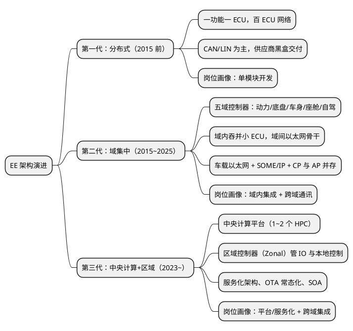

# 04-行业观察-新能源与域控

> 一句话定位：职业发展的环境变量——EE 架构从"一车百 ECU"走向"域集中+中央计算"，新能源三电重造软件需求，看懂这三条曲线，赛道选择才有坐标系。
> 等级：L2 ｜ 前置：[03-跳槽与晋升的取舍](03-跳槽与晋升的取舍.md)

## 太长不看

三条主曲线：①**电动化**——三电（电池/电机/电控）创造新 ECU 与新软件需求（BMS/VCU/MCU 控制），量产节奏快、迭代凶；②**架构集中化**——分布式 ECU → 域控制器（动力/底盘/车身/座舱/自驾五域）→ 中央计算+区域控制，单芯片从 MCU 走向"SoC+MCU 混装"；③**软件定义汽车（SDV）**——以太网/SOME-IP、AUTOSAR AP、OTA、持续交付进入车载。对个人的含义：**传统 MCU 技能不会过时，但正在被重新定价**——懂 CP 的人很多，"CP 深度 + 以太网/AP 一层"的人稀缺。

## 核心概念：EE 架构演进三代图

### 三代架构对工程师的要求差

| 维度 | 分布式 | 域集中 | 中央计算+区域 |
|---|---|---|---|
| 主芯片 | 8~32 位 MCU | MCU + SoC 混装 | 高算力 SoC + 实时核 |
| 主网络 | CAN/LIN | CAN(FD)+以太网骨干 | 以太网为主、CAN 长尾 |
| 软件栈 | 裸机/小 RTOS | AUTOSAR CP + 局部 AP | CP 实时域 + AP 服务域 + Linux |
| 核心技能 | 单模块 C 功底 | CP 集成 + 以太网/SOME-IP | 服务化设计 + 跨域/跨核 |
| 对应本库 | 01~08 区 | + [车载以太网](../../../05-汽车网络通讯/3-L3高级/车载以太网/README.md) | + [Classic vs Adaptive](../../../07-AUTOSAR架构/1-L1基础/架构总览/02-Classic-vs-Adaptive.md) |

## 详解

### 曲线一：新能源三电重塑软件版图

- **新 ECU 集群**：BMS（电池管理）、VCU（整车控制）、MCU（电机控制，注意与微控制器缩写撞名）、OBC/DCDC、充电相关——每一个都是嵌入式软件主场；
- **需求特征**：功能安全密度高（动力域 ASIL C/D 常态，见 [11 区功能安全](../../../11-功能安全与信息安全/README.md)）、标定工作量大（XCP/台架，见 [06 区标定](../../../06-诊断与标定/2-L2进阶/XCP与标定/README.md)）、迭代快于传统车；
- **机会判断**：三电软件人才缺口长期存在，且"懂控制策略的嵌入式工程师"比"纯策略工程师"更稀缺——你的 C/RTOS/总线地基在三电赛道是硬通货。

### 曲线二：域控改变"单兵作战"方式

- 域控芯片典型形态：高主频多核 MCU（TC397/S32G）或"SoC（Linux/ASIL 混合）+ 外挂安全 MCU"——多核集成、核间通信（[02 区多核](../../../02-芯片与体系结构/3-L3高级/多核架构/README.md)）成为日常；
- 域内要吞掉原来十几个小 ECU 的功能：BSW 集成复杂度暴涨——**CP 集成工程师需求不减反增**；
- 域间走车载以太网：SOME/IP 服务化通信、DoIP 诊断（[05 区以太网三篇](../../../05-汽车网络通讯/3-L3高级/车载以太网/README.md)）——这是 CP 工程师最顺滑的升级方向。

### 曲线三：SDV 与工具链变化

- OTA 常态化：Bootloader 双分区/回滚（[06 区](../../../06-诊断与标定/3-L3高级/Bootloader/01-刷写流程总览.md)）从加分项变必答题；
- 持续集成进车载：CI/自动化测试（[09 区单元测试](../../../09-调试与测试/2-L2进阶/单元测试与自动化/README.md)、[10 区工程化](../../../10-工具链与工程化/README.md)）岗位增加；
- AP（Adaptive Platform）在中央计算落地：C++14/POSIX/服务发现——但**AP 不是 CP 的替代而是分层共存**，实时控制域仍是 CP 的天下。

### 给个人押注的四条建议

1. **CP 打穿，以太网补一层**：CAN/CP 是存量市场（十年内不会消失），"CP 深度 + SOME-IP/DoIP"是当下性价比最高的组合；
2. **三电与功能安全交叉处最贵**：ASIL 项目经验 + 动力域知识，两个稀缺性相乘；
3. **别急着全仓 Linux**：座舱/自驾是另一个工种（应用/算法为主），嵌入式底子转过去优势有限；转 AP 之前先把 CP 做到能定方案；
4. **盯国产化与出海**：国产芯片（MCU/域控）替代加速，需要大量"能从芯片手册到量产"的驱动/集成工程师；出海（欧标/UNECE 法规）带来安全与诊断合规需求。

## 易错点与常见挂点

1. **把"传统 ECU 会消失"当真**——中央计算再集中，传感器/执行器边的实时控制仍需要 MCU 与区域控制器；CAN 生态的存量至少还有十年长尾；
2. **盲目转 Linux/座舱放弃 MCU 深度**——两头不靠：座舱是应用工种吃的是 UI/框架经验，你的寄存器功底用不上；正确姿势是"MCU 深度+以太网"贴着域控走；
3. **把 AP 当 CP 升级版学**——AP 是另一个技术栈（C++/POSIX/服务化），学习成本不小；没有实时域打底直接学 AP，容易两样都浅；
4. **忽视功能安全/信息安全的合规浪潮**——R155/R156（网络安全/软件升级法规）让安全机制从"大厂专属"变"出口刚需"，这是未来五年最稳的需求增量；
5. **只看新势力招聘热度**——新势力岗位波动大；传统 Tier1 与芯片厂（尤其国产芯片）提供更稳的成长曲线，跳槽决策要结合 [03 篇](03-跳槽与晋升的取舍.md) 的框架；
6. **用旧地图找新大陆**——拿着"会配 DaVinci"的简历投域控岗已不够；域控岗要的是"集成 + 跨域通讯 + 多核"的组合证据（对照 [02 篇雷达](02-技能雷达与成长复盘.md) 补维）。

## 灵魂三问（自问或被问）

**Q：你怎么看新能源对嵌入式工程师的影响？**
答：结构化三层："需求侧——三电创造全新 ECU 与软件需求，量在涨；技术侧——芯片从 MCU 走向 SoC+MCU，网络从 CAN 走向以太网骨干，技能要加一层；机会侧——最稀缺的是'传统实时功底+新架构认知'的交叉人才，我的路线就是 CP 打穿再补 SOME-IP。"有判断、有自己位置。

**Q：你觉得 AUTOSAR CP 会被 AP 取代吗？**
答：会共存不会取代："分工不同——CP 管确定性的实时控制（微秒级、静态配置），AP 管变化的计算服务（毫秒级、动态发现）；中央计算架构里两者分层共存，实时域反而因为功能集中更重要。我会先做深 CP，再横向理解 AP 的服务化思想（[07 区对比篇](../../../07-AUTOSAR架构/1-L1基础/架构总览/02-Classic-vs-Adaptive.md)）。"

**Q：如果让你选下一个五年赛道，选什么？**
答：给出"赛道 + 判据 + 已经在做的准备"："我押域控平台的 BSW/以太网方向——判据是架构集中化是不可逆曲线，而我的 CP 与总线积累能直接复用；已经在系统补 [车载以太网三篇](../../../05-汽车网络通讯/3-L3高级/车载以太网/README.md) 并在项目里争取 DoIP 相关任务。"答案要能看出你已经在路上，而不是规划在嘴上。

## 延伸

- 技术侧底图：[05 区/车载以太网](../../../05-汽车网络通讯/3-L3高级/车载以太网/README.md)（100BASE-T1/SOME-IP/DoIP）、[07 区/Classic vs Adaptive](../../../07-AUTOSAR架构/1-L1基础/架构总览/02-Classic-vs-Adaptive.md)、[02 区/多核架构](../../../02-芯片与体系结构/3-L3高级/多核架构/README.md)；
- 需求侧底图：[11 区/功能安全与信息安全](../../../11-功能安全与信息安全/README.md)——合规浪潮的一手知识；
- 决策配套：[03-跳槽与晋升的取舍](03-跳槽与晋升的取舍.md)、[01-方向与路径](01-方向与路径.md)；
- 信息输入源：[15 区/优质博客与网站索引](../../../15-资源收藏/优质博客与网站/00-索引.md)、[13 区/标准与书籍](../../../13-标准与书籍笔记/README.md)。

---

维护约定：笔记命名 `序号-主题.md`；真实截图放 `_images/`；流程/时序/状态/架构图用 PlantUML 内嵌正文，规范见 [图表规范与模板](../../../00-总览/图表规范与模板.md)。
