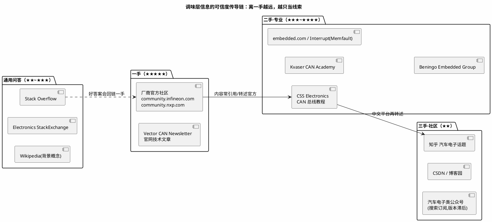

# 优质博客与网站 00：索引——调味层资源怎么挑

> 一句话定位：全库博客/论坛/社区类资源的总索引——按"官方社区 → 英文技术站 → 中文平台 → 通用问答"四层组织，每条标注可信度与替代品，并给出调味层资源的使用纪律（提线索不下结论）。
> 等级：L1 ｜ 前置：[信息食谱-如何挑选与消化资源](../00-入门导读/01-信息食谱-如何挑选与消化资源.md)

## 1. 核心概念：信息在网站间的"可信度传导链"

二手内容的可信度取决于它离一手资料的距离。记住传导链：**芯片/标准厂商（一手）→ 英文老牌技术站（二手但专业）→ 中文平台（三手，时效与翻译有损）**——离一手越远，越只配当"线索"。

| 层 | 典型站点 | 可信度 | 何时用 | 本区对应 |
|---|---|---|---|---|
| 官方社区 | Infineon/NXP 社区、Vector 文章 | ★★★★★ | 芯片/工具专属现象、官方人员回帖 | [01-英飞凌](../官方文档/01-英飞凌.md)/[02-NXP](../官方文档/02-NXP.md) |
| 英文技术站 | CSS Electronics、Kvaser、embedded.com、Interrupt | ★★★~★★★★ | CAN/LIN 系统入门、嵌入式方法论 | 本篇 |
| 中文平台 | 知乎、CSDN、博客园、公众号 | ★★ | 快速建立印象、找同类现象 | 本篇 |
| 通用问答 | Stack Overflow、Electronics SE、Wikipedia | ★★~★★★ | 代码级问题、概念背景 | 本篇 |

## 2. 详解：资源清单与点评

### 2.1 资源清单表

| 名称 | 入口 | 是什么 | 何时用 | 替代品 |
|---|---|---|---|---|
| CSS Electronics | csselectronics.com | CAN 总线教程站（入门到进阶的图解教程，附工具销售） | CAN/CAN-FD/J1939/OBD 快速入门 | [05 区 CAN 笔记](../../05-汽车网络通讯/README.md) |
| Kvaser CAN Academy | kvaser.com | CAN 硬件厂商的免费知识库（CAN 原理/错误处理专题） | CAN 位时序、错误帧等原理补课 | CSS Electronics |
| embedded.com | embedded.com | 老牌嵌入式媒体（专栏作者多为资深工程师） | 嵌入式工程方法、行业视角 | Interrupt |
| Interrupt（Memfault） | interrupt.memfault.com | Memfault 公司技术博客（固件 topics 深度长文） | 固件架构、调试技巧、RTOS 实践 | embedded.com |
| Beningo Embedded Group | beningo.com | 嵌入式顾问的博客+课程 | 状态机/架构设计方法论 | Interrupt |
| Stack Overflow | stackoverflow.com | 编程问答（英文） | C 语言细节、脚本问题 | CSDN（质量低一档） |
| Electronics StackExchange | electronics.stackexchange.com | 电路问答（英文） | 硬件电路疑问 | 知乎 |
| 知乎·汽车电子话题 | zhihu.com | 中文问答（搜索关键词进入话题流） | 中文入门、行业八卦/求职信息 | CSDN |
| CSDN/博客园 | csdn.net / cnblogs.com | 中文技术博客平台 | 搜工程报错原文（命中率最高） | Stack Overflow |
| Wikipedia | wikipedia.org | 百科（CAN/AUTOSAR 词条有引用链） | 概念背景、术语中英对照 | [术语表](../../00-总览/术语表.md) |

### 2.2 精选点评：为什么值得收藏

- **CSS Electronics 是 CAN 入门的"图解教科书"。** 它的 CAN 教程用大量动画级插图讲仲裁、位时序、错误帧，比多数教材直观；缺点是后半程导向自家产品——原理部分白嫖，选型部分打折听。适合第一次接触 CAN 的同事一天刷完。
- **Kvaser 与 CSS 互补：** Kvaser 的专题（如错误处理、bit timing 计算样例）更偏工程口径；两家都是厂商背景但教学内容公允。
- **Interrupt 是英文固件博客的质量天花板之一：** 深度长文（RTOS、固件更新、调试）出自一线工程师，适合每月固定翻一次而不是检索式阅读。
- **CSDN 的正确打开方式是"搜报错原文"。** 中文平台里 CSDN 对工程报错的命中率最高（复制粘贴报错信息直接搜）；但答案常是"抄来抄去的 workaround"，用前必核版本。
- **使用纪律（调味层铁律）：** ①看到结论先找它引用的一手出处；②记录"站点+日期+版本"再转述；③中文平台的数字/参数一律回官方文档复核；④公众号只当雷达（推送新主题），不当证据。

## 3. 易错点与陷阱（踩坑清单）

- **坑：把 CSDN 高赞答案当权威。** 高赞只代表"多"，不代表"对"——大量互抄的 workaround 可能掩盖根因。**对策：** 答案里给出一手出处的才采信；只给"改成这样就好了"的当线索。
- **坑：中文平台版本滞后放大错误。** AUTOSAR 中文教程普遍停在 4.x，S32K 教程混用 K1/K3 代号。**对策：** 每篇先看发布/更新日期，超过 3 年的 AUTOSAR 资料默认过时，回官方对版本。
- **坑：英文站也有软广。** 厂商博客（含 Kvaser/CSS/Memfault）后半程导向自家产品属正常商业行为。**对策：** 原理照收，选型对比自己按参数表重做。
- **坑：付费专栏收割焦虑。** "9.9 元学会 AUTOSAR"类专栏多为公开资料汇编。**对策：** 付费前先看作者公开内容的工程深度（有没有真实配置工具截图与报错现场）。
- **坑：收藏不管理等于没收藏。** 无标签的收藏夹三个月后自己都不敢点。**对策：** 按本区索引表格式管理——每条资源记"入口/是什么/何时用/替代品"，失效条目定期清理。

## 4. 面试高频题

**Q：你平时从哪些渠道跟进汽车电子/嵌入式技术？怎么保证信息可靠？**

答：分层跟——一手（厂商社区/官方文档 Release Notes）、二手（CSS Electronics、embedded.com、Interrupt 等英文站）、三手（知乎/公众号当雷达）。可靠性靠两条纪律：二手以下只提线索不下结论；任何参数/API 回官方文档核对版本。

**Q：中文技术平台（知乎/CSDN）的 AUTOSAR 文章，你怎么评估能不能信？**

答：三看——看发布日期（是否停在 4.x 时代）、看是否标注标准版本与工具版本、看有没有一手出处链接。三看齐全才作为参考，否则只当入门印象，动手前回 SWS 核对。

**Q：遇到一个全网搜不到的 CAN 罕见现象，你的信息检索升级路径是什么？**

答：①换英文关键词重搜（site:community.infineon.com / nxp.com）；②查两家社区未结帖 + 提问（附完整 trace 与配置）；③翻 CiA/ASAM 技术文档与 Errata；④走 FAE/工单渠道。社区找不到≠没答案，可能是问法不对或该问厂商。

## 5. 延伸

- [官方文档](../官方文档/README.md)：一手层（英飞凌/NXP/Vector/AUTOSAR）入口地图；
- [开源项目/00-索引](../开源项目/00-索引.md)：工具型资源的开源替代；
- [视频课程/00-索引](../视频课程/00-索引.md)：调味层的视频形态与选课纪律；
- [05 区汽车网络通讯](../../05-汽车网络通讯/README.md)：CAN/LIN 教程对应的本库深水笔记；
- [信息食谱](../00-入门导读/01-信息食谱-如何挑选与消化资源.md)：本索引遵循的四层食谱方法论。

---

维护约定：笔记命名 `序号-主题.md`；真实截图放 `_images/`；流程/时序/状态/架构图用 PlantUML 内嵌正文，规范见 [图表规范与模板](../../00-总览/图表规范与模板.md)。
