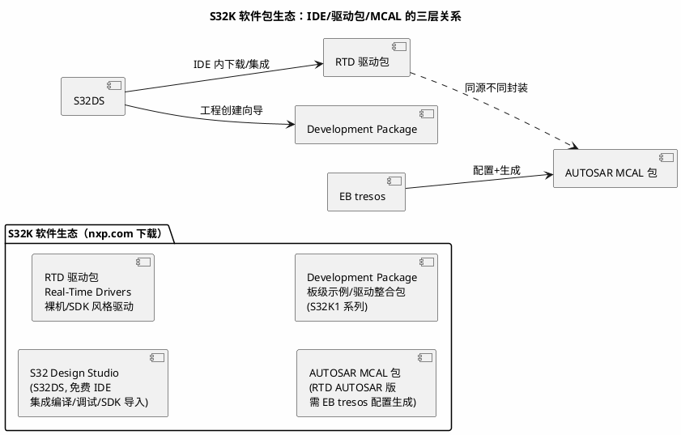

# 官方文档 02：NXP——S32K 文档中心与软件包入口地图

> 一句话定位：把 nxp.com 上 S32K1/S32K3 的参考手册、Errata、RTD/MCAL 软件包、AppNote 与社区入口整理成一张地图，重点讲清"Reference Manual 一本大书怎么啃"与"S32DS/RTD/MCAL 三层软件包怎么找"。
> 等级：L1 ｜ 前置：[01-英飞凌](01-英飞凌.md)（对照两家文档组织差异更清楚）

## 1. 核心概念：NXP 文档与软件包体系

NXP 与英飞凌最大的差异有两点：**文档侧**——S32K 用一本厚厚的 Reference Manual（RM）覆盖全部外设（而非分册），配上独立的 Data Sheet 与 Errata；**软件侧**——S32K 生态是"S32DS（IDE）+ RTD（Real-Time Drivers 驱动包）+ MCAL（AUTOSAR 驱动，经 EB tresos 生成）"三层结构，软件包之间的版本匹配关系是新手第一大坑。

注意：`[EB tresos]` 是 Elektrobit 工具（见 [EB tresos 笔记](../../10-工具链与工程化/2-L2进阶/AUTOSAR配置工具/02-EB-tresos.md)），NXP 只提供 MCAL 插件包——配置工具本身不在 nxp.com 下。

| 文档/资源 | 是什么 | 何时用 | 替代品 |
|---|---|---|---|
| Data Sheet | 电气参数/封装/资源概览 | 选型、查引脚 | 无 |
| Reference Manual（RM） | 全外设寄存器级描述（一本大书） | 配外设、查位定义、中断向量 | 13 区芯片手册阅读笔记 |
| Errata | 已知问题与规避 | 新批次/诡异 bug 时 | FAE/社区搜同类现象 |
| Safety Manual | 安全手册（部分需授权） | 功能安全项（26262 流程） | 11 区功能安全笔记 |
| Application Notes | 专题（AN 编号） | 做特定功能前搜一遍 | 社区文章（可信度低一档） |
| RTD/MCAL Release Notes | 版本变化与已知限制 | **每次升级软件包前** | 无（必读） |

## 2. 详解：入口地图逐条走

### 2.1 资源清单表

| 名称 | 入口 | 是什么 | 何时用 | 替代品 |
|---|---|---|---|---|
| NXP 官网 S32K 页 | nxp.com（S32K Microcontrollers） | S32K1/S32K3 产品与文档总入口 | 一切查询起点 | site:nxp.com 搜索 |
| S32K1/S32K3 文档列表 | 产品页 → Documentation | RM/Data Sheet/Errata/AN 下载 | 下载 PDF、核对版本 | 本地 PDF 归档 |
| S32 Design Studio | nxp.com（S32DS 下载页） | 免费 IDE，含 RTD/SDK 下载集成 | 建工程、编译烧录 | [S32DS 笔记](../../10-工具链与工程化/1-L1基础/IDE/02-S32DS.md) |
| RTD / AUTOSAR MCAL 包 | nxp.com（Software & Tools） | 裸机驱动包 / tresos 用 MCAL 包 | 按项目形态选其一 | 英飞凌 MCAL（跨平台时） |
| NXP 社区 | community.nxp.com | 论坛，官方工程师活跃 | 现象级问题、版本匹配坑 | StackOverflow |
| NXP 培训视频 | nxp.com 培训页 + 官方 YouTube | S32K/汽车电子课程 | 入门 S32K 生态 | [视频课程索引](../视频课程/00-索引.md) |
| SafeAssure 页 | nxp.com（SafeAssure） | 功能安全资源汇总 | 26262 项目立项时 | [11 区](../../11-功能安全与信息安全/README.md) |
| S32K 评估板资料 | nxp.com（评估板产品页） | EVB 原理图/用户指南/例程入口 | 自制板前对照最小系统 | 板卡随附文档 |
| 参考设计/硬件设计指南 | nxp.com（Reference Designs/AN） | 官方硬件参考设计 | 布板与电源设计借鉴 | [03 区硬件笔记](../../03-硬件基础/README.md) |
| NXP 站内搜索 | nxp.com（站内搜索框） | 全站文档/软件统一检索 | 只知道关键词不知入口时 | Google site:nxp.com |

### 2.2 精选点评：为什么值得收藏

- **Reference Manual 虽厚，但结构稳定：** 每个外设章节都是"功能简介 → 时钟/复位 → 寄存器列表 → 初始化流程"的固定套路。啃法：目录遍（半天）标记外设章节页码 → 项目用到的章节精读 → 排障时全文检索寄存器名。别被 1500+ 页吓退，你一次只需要其中两章。
- **RTD 与 MCAL 是"同源双封装"：** 同一批外设知识，RTD 以 C 函数库形态给裸机/SDK 用户，MCAL 以 AUTOSAR 标准接口形态给 tresos 用户。对照着看（RTD 源码可读性好）能加深对 [MCAL-vs-RTD](../../04-MCAL与外设驱动/1-L1基础/MCAL总览/02-MCAL-vs-iLLD-vs-RTD.md) 的理解。
- **Release Notes 被严重低估：** RTD/MCAL 每版的 Known Issues 与 Behavior Change 常直接命中你的问题。使用姿势：升级软件包前先 diff 两版 Release Notes，再决定升不升。
- **引脚复用要"PDF+工具"对照看。** Data Sheet 的 Signal Multiplexing 表信息密度极高，配 S32DS 的 Pins 配置工具一起看，选型效率翻倍——纯翻 PDF 是最慢路径。
- **使用姿势：** nxp.com 多数文档与软件包下载需要免费注册账号（公司邮箱），提前注册好；PDF 按 `NXP_S32K1xxRM_vXX.pdf` 命名归档，并在工程 README 记录"RM 版本 + RTD 版本 + S32DS 版本"三件套。

## 3. 易错点与陷阱（踩坑清单）

- **坑：软件包版本不匹配。** S32DS、RTD、MCAL 插件、tresos 版本两两之间有兼容矩阵，随手装最新版常报"插件不识别"。**对策：** 先读 MCAL 包 Release Notes 里的兼容表，按表配套安装；版本三件套记进工程 README。
- **坑：拿 S32K1 资料配 S32K3。** 两代架构差异大（内核、外设命名、安全机制），博客混用代号误导人。**对策：** 先确认目标芯片型号，S32K1（如 S32K144）与 S32K3 分开建资料夹，互不引用（对比见 [S32K1与S32K3对比](../../02-芯片与体系结构/1-L1基础/S32K平台/S32K1与S32K3对比/README.md)）。
- **坑：只看 RM 不看 Data Sheet。** RM 不讲电气参数——采样精度、IO 驱动能力、时序余量都在 Data Sheet。**对策：** 涉及硬件相关结论（如 ADC 采样时间计算）必须两本对照（方法见 [采样时间与源阻抗](../../03-硬件基础/2-L2进阶/模拟电路/ADC采样原理/03-采样时间与源阻抗.md)）。
- **坑：中文翻译版 RM 过时。** 网上流传的中文 RM 多为老版本，寄存器位定义有出入。**对策：** 中文版只当入门读物，寄存器操作以英文原版+当前版本为准。
- **坑：社区答案不核版本直接抄。** community.nxp.com 高赞答案可能基于旧 RTD，API 已改名。**对策：** 抄前核对该答案的时间与软件包版本，再对照当前 RTD 头文件签名。
- **坑：登录墙反复拦路。** 未登录时部分文档链接跳转到登录页，让人误以为链接坏了。**对策：** 先登录 nxp.com 再逛文档页；常用文档下载后本地归档。

## 4. 面试高频题

**Q：S32K144 上配 LPSPI，你会查哪些 NXP 文档？与英飞凌查文档的路数有何不同？**

答：查 S32K1xx Reference Manual 的 LPSPI 章（功能/时钟/寄存器位）+ Data Sheet（引脚复用与时序参数）+ Errata。不同点：英飞凌 UM 按外设分册，NXP 是一本 RM 全覆盖——NXP 侧更多用"PDF 全文检索寄存器名"定位，英飞凌侧先选对分册再读。

**Q：RTD 和 AUTOSAR MCAL 包是什么关系？项目里怎么选？**

答：同源双封装——RTD 是裸机/SDK 风格驱动库，MCAL 是按 AUTOSAR MCAL SWS 接口封装、需 EB tresos 配置生成的版本。裸机或轻量项目选 RTD（上手快、源码可读）；标准 AUTOSAR 分层项目选 MCAL（接口标准、可被上层 BSW 复用）。

**Q：新接手一个 S32K 项目，软件环境装到一半冲突不断，你按什么顺序排查？**

答：先确认三件套版本（S32DS/RTD 或 MCAL/tresos）→ 对照 MCAL 包 Release Notes 的兼容矩阵逐项核对 → 清理重装不兼容组件 → 仍冲突则上社区搜具体报错（带版本号提问）。核心是"按官方兼容表配套"，而不是各装最新。

## 5. 延伸

- [03-Vector](03-Vector.md)：总线工具侧的文档入口（CANoe/CANdela 手册怎么找）；
- [MCAL-vs-iLLD-vs-RTD](../../04-MCAL与外设驱动/1-L1基础/MCAL总览/02-MCAL-vs-iLLD-vs-RTD.md)：三套生态的完整对比；
- [S32K 平台笔记](../../02-芯片与体系结构/1-L1基础/S32K平台/README.md)：时钟/FTFC/外设速查的深水区；
- [EB tresos](../../10-工具链与工程化/2-L2进阶/AUTOSAR配置工具/02-EB-tresos.md)：MCAL 配置生成的实操；
- [13 区芯片手册阅读](../../13-标准与书籍笔记/7-阅读笔记/芯片手册/README.md)：RM 精读笔记落脚区（S32K 原件归 [13 区 3-芯片手册](../../13-标准与书籍笔记/3-芯片手册/README.md)）。

---

维护约定：笔记命名 `序号-主题.md`；真实截图放 `_images/`；流程/时序/状态/架构图用 PlantUML 内嵌正文，规范见 [图表规范与模板](../../00-总览/图表规范与模板.md)。
