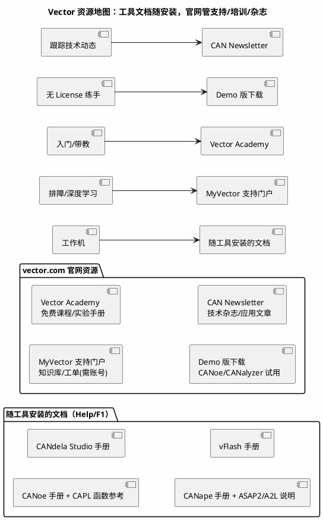

# 官方文档 03：Vector——总线工具与诊断链文档入口地图

> 一句话定位：把 vector.com 上 CANoe/CANdela/CANape/vFlash 等工具的手册、知识库、Academy 培训与 Demo 版入口整理成地图，讲清"Vector 文档不在官网 PDF 里、而在工具 Help 里"这个反直觉事实。
> 等级：L1 ｜ 前置：[02-NXP](02-NXP.md)

## 1. 核心概念：Vector 文档体系的"藏法"与别家不同

英飞凌/NXP 的文档在官网下载页，Vector 的核心文档**随工具安装**——CANoe 的手册、CAPL 函数参考、Panel/Simulation 说明都在软件 Help 菜单里（F1 直达），且与版本严格对应。官网上真正值得收藏的是四样：**MyVector 支持门户（知识库/工单）、Vector Academy（免费培训）、Demo 版下载、CAN Newsletter（技术杂志）**。

| 资源 | 是什么 | 何时用 | 替代品 |
|---|---|---|---|
| 工具内 Help/F1 | 与**当前版本**严格对应的手册与 CAPL 参考 | 写 CAPL、配选项、查功能支持 | 无（第一权威） |
| MyVector 支持门户 | 知识库文章 + 技术工单 | 安装/驱动/License/深度排障 | 销售渠道支持 |
| Vector Academy | 免费在线课程与实验手册 | 系统学 CANoe/CAPL/诊断 | [视频课程索引](../视频课程/00-索引.md) |
| Demo 版 | 有功能/时长限制的免费 CANoe/CANalyzer | 无 License 时练 CAPL、回放 blf | 开源工具（[开源项目索引](../开源项目/00-索引.md)） |
| CAN Newsletter | Vector 技术杂志（总线/诊断/以太网文章） | 跟踪技术动态、找应用案例 | 行业公众号（中文二手） |

## 2. 详解：入口地图逐条走

### 2.1 资源清单表

| 名称 | 入口 | 是什么 | 何时用 | 替代品 |
|---|---|---|---|---|
| Vector 国际站 | vector.com | 产品/文档/培训总入口 | 一切查询起点 | vector.com/china 中文站 |
| Vector 中文站 | vector.com/china | 中文产品资料与本地培训 | 中文沟通/报价 | 国际站（内容更全） |
| MyVector 门户 | vector.com（Support/Login） | 知识库 + 工单 + License 管理 | 排障、查已知问题 | 销售FAE |
| Vector Academy | vector.com（Training/Academy） | 免费课程、实验材料下载 | 带新人、自学 CAPL | 公司内部培训 |
| Demo/Viewer 下载 | vector.com（Downloads） | CANoe/CANalyzer Demo、驱动包 | 练手、看 blf 回放 | BUSMASTER/SavvyCAN |
| CAN Newsletter | can-newsletter.org | 技术文章汇编 | 找总线/以太网应用案例 | 学术论文 |
| XL Driver Library | vector.com（Downloads） | VN 系列硬件驱动与二次开发接口 | 自研上位机/自动化脚本 | python-can 后端 |
| MICROSAR 产品页 | vector.com | Vector 商用 BSW 栈产品资料 | 了解商业栈形态（对照标准） | EB/ETAS 同类产品 |

### 2.2 精选点评：为什么值得收藏

- **CAPL 函数参考是最常被翻烂的一页。** 写 CAPL 时不要百度函数名（搜到的是旧版本签名），直接 Help → CAPL Reference，按当前 CANoe 版本核对参数与返回值——CAPL 函数在大版本间有增删改，版本错配是 CAPL 编译错误的主要来源。
- **Academy 课程被严重低估。** 它有从"CANoe 入门"到"诊断/以太网"的成体系免费课程，质量远高于市面付费课，且实验手册可下载——带新人时直接甩链接比自己讲省一周。
- **Demo 版是零成本练手路径。** 学生/转行者没有公司 License 时，Demo 版 CANoe + 官方 Demo 工程足够把 CAPL、Panel、仿真节点练到熟练；进阶再用开源 BUSMASTER/SavvyCAN 补全真实硬件链路。
- **XL Driver Library 是自研上位机的钥匙。** 用 VN 系列硬件做 Python/C# 自动化绕不开它，接口手册就在下载中心——先读它的设备枚举与通道映射章节再动手，能少走一天弯路。
- **使用姿势：** 手册随工具走——工位换机器先确认 CANoe 版本再查对应 Help；知识库文章标题常带产品与版本号，检索时把版本号一起输；遇到 License/安装问题直接提工单，比社区等答案快。

## 3. 易错点与陷阱（踩坑清单）

- **坑：网上下载的"CANoe 手册 PDF"与你的版本不符。** CAPL 函数签名/选项路径对不上，照抄编译报错。**对策：** 只用本机 Help；PDF 手册注明来源版本，过版即弃。
- **坑：拿 Demo 版当生产工具。** Demo 有功能/运行时长限制，正式交付测试用它会被中途掐断。**对策：** Demo 只用于学习；正式项目走公司 License。
- **坑：中文站内容滞后于国际站。** 新功能说明、知识库文章国际站先有。**对策：** 中文站看商务信息，技术内容以国际站为准。
- **坑：知识库文章不看适用版本。** 搜到的 KB 是针对老版本 CANoe 的操作路径，新版本菜单位置已变。**对策：** 核对文章标注的版本范围；对不上就按新版本 Help 重新定位菜单。
- **坑：把 CANdela/CANape 的概念混着查。** CANdela 管诊断数据库（CDD/ODX），CANape 管标定（A2L/XCP），查错手册浪费时间。**对策：** 先按"诊断 vs 标定"分流（见 [CANdela 与 ODX](../../09-调试与测试/2-L2进阶/总线工具/04-CANdela与ODX.md)、[CANape 实操](../../06-诊断与标定/2-L2进阶/XCP与标定/03-CANape实操.md)）。

## 4. 面试高频题

**Q：写 CAPL 脚本时函数用法拿不准，你查什么？为什么不建议百度？**

答：查本机 CANoe 的 Help → CAPL Function Reference——它与当前安装版本严格对应；百度/博客搜到的常是旧版本签名，CAPL 函数在版本间有增删改，照抄会编译错误。版本意识是 CAPL 排错第一步。

**Q：没有公司 Vector License，怎么练 CANoe 和 CAPL？**

答：官网下载 Demo 版 CANoe（功能/时长受限但可写 CAPL、跑 Demo 工程）；配合 Vector Academy 免费课程系统学；硬件链路用开源工具（BUSMASTER/SavvyCAN/python-can）补齐——求职时"Demo 版练出的 CAPL 能力"完全够过基础笔试。

**Q：CANdela 和 CANape 分别管什么？各自的"数据格式"入口文档在哪查？**

答：CANdela 管诊断数据库（CDD，可导出 ODX），CANape 管标定与测量（A2L 描述 + XCP 协议）。格式细节查各自工具内 Help 与 ASAM 标准（ODX/A2L 归 ASAM，见 [04-AUTOSAR官网](04-AUTOSAR官网.md) 的标准组织入口）。

## 5. 延伸

- [04-AUTOSAR官网](04-AUTOSAR官网.md)：AUTOSAR 标准与 ASAM/ISO 等标准组织入口；
- [CANoe](../../09-调试与测试/2-L2进阶/总线工具/01-CANoe.md)：工具本体的深水笔记；
- [CAPL](../../09-调试与测试/2-L2进阶/总线工具/02-CAPL.md)：CAPL 语言笔记；
- [开源项目索引](../开源项目/00-索引.md)：无 License 时的开源替代工具；
- [13 区标准与书籍笔记](../../13-标准与书籍笔记/README.md)：CAN/诊断相关标准的阅读笔记。

---

维护约定：笔记命名 `序号-主题.md`；真实截图放 `_images/`；流程/时序/状态/架构图用 PlantUML 内嵌正文，规范见 [图表规范与模板](../../00-总览/图表规范与模板.md)。
