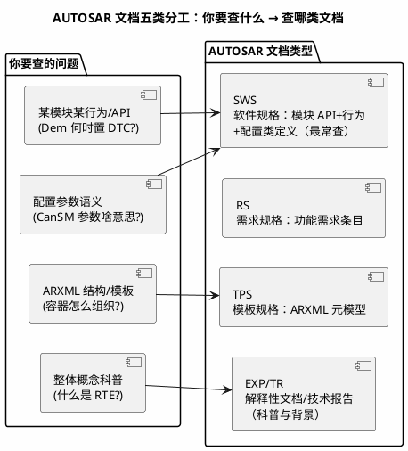

# 官方文档 04：AUTOSAR 官网与标准组织——文档类型地图与会员工具生态

> 一句话定位：把 autosar.org 的标准下载体系（SWS/RS/TR/EXP/TPS 五类文档怎么分）、版本命名演进、以及周边标准组织（ASAM/CiA/ISO/SAE）与会员工具厂商（Vector/EB/ETAS/Kalray 等）入口收进一张地图。
> 等级：L1 ｜ 前置：[03-Vector](03-Vector.md)

## 1. 核心概念：AUTOSAR 文档的五类分工

autosar.org 的标准不是一本书，而是上百份 PDF 的组合，每份有明确的文档类型前缀。查 BSW 行为先分清"该查哪类"，否则面对搜索结果无从下手：

| 类型 | 全称 | 什么时候查 | 本库深水区 |
|---|---|---|---|
| SWS | Software Specification | 查模块 API/行为/配置参数——**日常 80% 的查询落在这** | [13 区 AUTOSAR规范](../../13-标准与书籍笔记/7-阅读笔记/AUTOSAR规范/README.md) |
| RS | Requirements Specification | 追需求来源与动机 | 同上 |
| TPS | Template Specification | ARXML 元模型、容器结构 | [ARXML 手读](../../07-AUTOSAR架构/2-L2进阶/方法论与ARXML/03-ARXML手读.md) |
| EXP/TR | Explanatory / Technical Report | 概念入门（如 E2E、Methodology） | 07 区架构总览 |
| MOD/MET | Methodology 等 | 流程/角色/工件定义 | 项目流程梳理时 |

版本命名：老版本 4.0~4.4.1；2019 年起改为 **R19-11/R20-11/R21-11…**（年-月）——看资料先对版本号，中文博客大量停在 4.x 时代（[导读防迷路清单](../00-入门导读/01-信息食谱-如何挑选与消化资源.md)）。

## 2. 详解：入口地图逐条走

### 2.1 资源清单表

| 名称 | 入口 | 是什么 | 何时用 | 替代品 |
|---|---|---|---|---|
| AUTOSAR 官网 | autosar.org | 标准下载/新闻/成员列表 | 下 SWS 等标准 PDF | 无（唯一权威） |
| 标准下载页 | autosar.org（Standards/Classic & Adaptive） | 按版本分组的全部 PDF（同意条款后免费下载） | 查模块行为、对版本差异 | 13 区笔记（二手摘要） |
| AUTOSAR 官网 FAQ/术语 | autosar.org | 官方概念解释 | 术语纠偏 | [术语表](../../00-总览/术语表.md) |
| Artop | artop.org | 开源 AUTOSAR 工具平台（实现元模型，多家厂商在其上做工具） | 理解元模型/做 ARXML 工具 | 商业配置工具 |
| 会员工具厂商门户 | vector.com / elektrobit.com / etas.com / kalray.com | 各家 BSW 栈与配置工具文档（MICROSAR/EB tresos/ETAS/Arctive 系） | 用哪家栈就进哪家门户 | [10 区配置工具笔记](../../10-工具链与工程化/2-L2进阶/AUTOSAR配置工具/README.md) |
| 周边标准组织 | asam.net（ODX/A2L）、can-cia.org（CAN）、iso.org、sae.org | 诊断数据格式/CAN/安全与法规标准 | 跨界查询（格式/协议/法规） | 13 区 ISO 标准笔记 |
| 官方活动/技术日 | autosar.org（Events） | 官方研讨会与成员活动 | 追标准动向、找材料 | 成员厂商活动页 |

### 2.2 精选点评：为什么值得收藏

- **SWS 是 AUTOSAR 工程师的"字典"，PDF 全文检索是核心技能。** 下载目标模块 SWS（如 AUTOSAR_SWS_CANDriver）后，直接搜函数名/配置参数名，语义、约束、SWS 要求编号一步到位——比任何教程准确。用法上和芯片手册一样走三遍法：目录遍 → 用到章节遍 → 排障遍。
- **版本对照意识决定你是不是"活的"资料用户。** R19-11 之后 API 与配置类有实打实的变化（如若干模块的状态机与容器改名）。收藏夹里给每个常用 SWS 记两版：项目基线版 + 最新版，diff 着看变化。
- **周边标准组织常被忽略但一查一个准：** ODX/A2L 归 ASAM、CAN 协议归 CiA/ISO、J1939 归 SAE——诊断数据库与总线协议问题去对的组织查，比在 AUTOSAR 官网里空转高效。做整车能耗方向再关注 openVEC 开源项目（GitHub 可搜）。
- **按 release 节奏规划基线：** AUTOSAR 每年秋季固定发新 release（R19-11 起），项目立项选"上一个稳定版"而非追最新——工具链适配永远滞后标准半年到一年。
- **会员工具厂商门户是"落地版文档"入口：** 标准讲"是什么"，工具门户讲"在我们家怎么配"——用 MICROSAR 看 Vector 门户、用 tresos 看 EB 门户、用 ETAS 栈看 etas.com、用 Kalray（收购 Arccore 系工具链）看 kalray.com，各家 Release Notes 里还有对标准的偏差声明，读它能发现"标准允许的实现自由度"。

## 3. 易错点与陷阱（踩坑清单）

- **坑：拿 4.x 时代的资料对 R20-11 项目。** 博客/老教材里的容器名、状态机与新版本有出入，照抄配置路径找不到。**对策：** 每份二手资料先问"基于哪个 release"，再下对应版本 SWS 对照。
- **坑：Classic 与 Adaptive 文档混着查。** 两平台模块清单与机制完全不同（ara::com vs RTE），搜 "Adaptive Communication Management" 的结论用不到 Classic 工程上。**对策：** 下载页先选对平台分组（概念对比见 [Classic vs Adaptive](../../07-AUTOSAR架构/1-L1基础/架构总览/02-Classic-vs-Adaptive.md)）。
- **坑：以为标准下载要付费/注册而去找盗版包。** 官网同意使用条款后即可免费下载正版 PDF；网盘"全集"常混入草稿版。**对策：** 只从 autosar.org 下载，文件名自带版本号，别用改名过的二手包。
- **坑：把厂商实现当标准本身。** tresos/DaVinci 的参数命名是厂商对标准的落地，与 SWS 配置类名有映射差异。**对策：** 概念以 SWS 为准，操作以工具手册为准，两边对不上时查工具的"标准符合性说明"。
- **坑：只下 SWS 不下 Methodology/TPS。** 涉及 ARXML 结构与流程角色的问题（如"这个容器为什么生成不出来"）答案常在 TPS/MET 而非 SWS。**对策：** 常用模块 SWS 之外，TPS（模板）与方法学报告各留一份。

## 4. 面试高频题

**Q：AUTOSAR 的 SWS、RS、TPS 分别是什么？查 CanIf 某配置参数语义你查哪个？**

答：SWS 是模块软件规格（API+行为+配置类定义），RS 是需求规格，TPS 是 ARXML 模板规格。查 CanIf 配置参数语义查 **SWS_CanIf**（配置类章节），涉及参数在 ARXML 里怎么组织再查 TPS。

**Q：AUTOSAR 版本号 R19-11、R20-11 是什么意思？为什么查资料要对版本？**

答：2019 年 11 月起 AUTOSAR 改用"年-月"命名 release（R19-11=2019 年 11 月发布），取代老的 4.x 编号。不同 release 间模块 API/配置类/状态机有变化，版本对不上，博客结论与工程实际就会"看起来都对、跑起来全错"。

**Q：ODX、A2L、DBC 这些格式分别归哪个组织管？去哪查官方定义？**

答：ODX 与 A2L 归 ASAM（asam.net，MCD-2 标准）；CAN 报文数据库 DBC 是 Vector 的事实标准（随 CANdb++ 工具文档）；CAN 协议本体在 ISO 11898（iso.org）与 CiA（can-cia.org）。按组织分流查询，别在 AUTOSAR 官网里找非 AUTOSAR 管辖的格式定义。

## 5. 延伸

- [如何查 SWS](../../07-AUTOSAR架构/1-L1基础/SWS阅读法/01-如何查SWS.md)：SWS 结构与检索技巧的深水笔记；
- [13 区 AUTOSAR规范](../../13-标准与书籍笔记/7-阅读笔记/AUTOSAR规范/README.md)：SWS/RS 阅读笔记落脚区（标准原件在 [13 区 2-AUTOSAR标准](../../13-标准与书籍笔记/2-AUTOSAR标准/README.md)）；
- [ARXML 手读](../../07-AUTOSAR架构/2-L2进阶/方法论与ARXML/03-ARXML手读.md)：TPS 元模型落地到 ARXML 长什么样；
- [优质博客与网站索引](../优质博客与网站/00-索引.md)：AUTOSAR 二手解读源的可信度标注；
- [版本演进](../../07-AUTOSAR架构/1-L1基础/架构总览/03-版本演进.md)：4.x→R2x 各版主要变化的深水笔记；
- [开源项目索引](../开源项目/00-索引.md)：Artop 等开源标准工具的实战入口。

---

维护约定：笔记命名 `序号-主题.md`；真实截图放 `_images/`；流程/时序/状态/架构图用 PlantUML 内嵌正文，规范见 [图表规范与模板](../../00-总览/图表规范与模板.md)。
