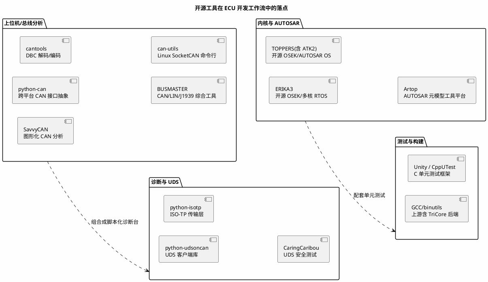

# 开源项目 00：索引——CAN/UDS/OS 开源工具总表

> 一句话定位：全库开源项目总索引——按"总线工具 → 诊断与 UDS → RTOS 与 AUTOSAR 内核 → 测试框架 → 工具链"五类组织，只列真实存在的项目，每条标注"是什么/何时用/替代品"，读源码学架构、用工具提效率两不误。
> 等级：L1 ｜ 前置：[信息食谱-如何挑选与消化资源](../00-入门导读/01-信息食谱-如何挑选与消化资源.md)

## 1. 核心概念：开源工具在工作流里的位置

开源项目对这个岗位有两重价值：**当工具用**（省 License、脚本化批量处理）与**当教材读**（工业级 C 代码的组织方式）。先看清它们在你日常工作流里的落点，再按需取用：

| 类别 | 何时用 | 本库深水区 |
|---|---|---|
| 总线工具 | 抓包分析、报文编解码、自动化测试脚本 | [05 区](../../05-汽车网络通讯/README.md) |
| 诊断与 UDS | 写诊断脚本、批量刷写/DID 验证 | [06 区](../../06-诊断与标定/README.md) |
| 内核与 AUTOSAR | 读真实 OSEK 内核源码、研究调度实现 | [08 区 OSEK](../../08-操作系统/2-L2进阶/OSEK与AUTOSAR-OS/01-OSEK内核.md) |
| 测试与构建 | CDD/BSW 模块单元测试、TriCore 交叉编译 | [09 区单测](../../09-调试与测试/2-L2进阶/单元测试与自动化/README.md) |

## 2. 详解：分类清单与点评

### 2.1 资源清单表（均为真实项目，入口只记到域名/仓库搜索级）

| 名称 | 入口 | 是什么 | 何时用 | 替代品 |
|---|---|---|---|---|
| python-can | GitHub/文档站搜 python-can | Python 的 CAN 接口抽象层（PCAN/Kvasal/SocketCAN/串口等多后端） | 脚本化收发报文、自动化回归 | CANoe CAPL（商用） |
| cantools | GitHub 搜 cantools | DBC 解析、报文编解码、cangen 等命令行工具 | 批量解码 blf/asc、CI 里校验报文 | CANdb++（商用） |
| SavvyCAN | GitHub 搜 SavvyCAN | 跨平台图形化 CAN 分析工具（配合 GVRET/candle 类硬件） | 无 CANoe 时的可视化抓包分析 | BUSMASTER |
| BUSMASTER | busmaster.io | 开源 CAN/LIN/J1939 综合工具（Bosch 印度背景） | Windows 上免费仿真+硬件联调 | CANoe Demo |
| can-utils | GitHub 搜 can-utils | Linux SocketCAN 命令行工具集（candump/cansend） | Linux 主机/树莓派侧总线调试 | python-can |
| cannelloni | GitHub 搜 cannelloni | CAN over Ethernet（UDP）隧道 | 台架远程拉 CAN、跨机房组网 | VPN+can-utils 组合 |
| com-assistant | GitHub/Gitee 搜 com-assistant | 国内开源串口/CAN 调试助手 | 快速串口联调、简单 CAN 收发 | 商业串口助手 |
| python-udsoncan | GitHub 搜 udsoncan | UDS（ISO 14229）Python 客户端库 | 写诊断脚本、自动化 EOL 测试 | CANdela/DTS（商用） |
| python-isotp | GitHub 搜 python-isotp | ISO-TP（15765-2）传输层实现 | UDS 之下的多帧传输 | 自写 isotp 栈（不推荐） |
| CaringCaribou | GitHub 搜 CaringCaribou | 面向安全的 UDS/CAN 测试工具 | 诊断接口安全评估 | 手写 fuzz 脚本 |
| ERIKA3 | GitHub/官网搜 ERIKA Enterprise | 开源 OSEK/VDX RTOS，支持多核 | 读真实内核源码、低成本项目 | FreeRTOS（非 OSEK） |
| TOPPERS（ATK2 等） | toppers.jp | 日本开源 RTOS 家族，ATK2 对应 AUTOSAR OS | 对照 AUTOSAR OS 规范读实现 | ERIKA3 |
| Artop | artop.org | AUTOSAR 元模型开源工具平台 | 理解 ARXML 元模型、自研工具底座 | 商业配置工具 |
| Unity / CppUTest | GitHub 搜 ThrowTheSwitch Unity、CppUTest | C/C++ 单元测试框架 | CDD/BSW 模块单测 | Tessy（商用） |
| GCC TriCore 后端 | gcc.gnu.org | 上游 GCC/binutils 含 TriCore 目标支持 | TC377 交叉编译（配 HighTec 发行版） | TASKING/HighTec 商业版 |

### 2.2 精选点评：为什么值得收藏

- **python-can + cantools + python-udsoncan 是"免费诊断台"三件套：** 三者组合能在半小时内搭出"收发报文→解码 DBC→跑 22/2E/19 脚本"的自动化台架，是个人提升与 EOL 小工具的主力；写法上把它们当库用而非命令行，可维护性最好。
- **ERIKA3/TOPPERS 是读"真内核"的最近入口：** 商业 AUTOSAR OS 拿不到源码，这两个开源 OSEK 系内核规模适中、注释完整，读它们的调度器与中断管理，比只啃规范强十倍——配合 [08 区 OSEK 笔记](../../08-操作系统/2-L2进阶/OSEK与AUTOSAR-OS/01-OSEK内核.md)食用。
- **SavvyCAN/Busmaster 解决"家里没 CANoe"：** 配合百元级开源 USB-CAN 硬件即可在家搭抓包环境；界面不如 CANoe 精致，但学协议足够。
- **读源码的姿势：** 先读 README 与目录结构画出模块图，再从 main/入口函数跟踪一条完整调用链（如 python-can 的一条 send 路径），最后读它的单元测试反推 API 设计——这套流程本身比结论更值钱。

## 3. 易错点与陷阱（踩坑清单）

- **坑：把"开源 AUTOSAR 栈"当生产可用。** 多数开源 AUTOSAR 系仓库（ArcCore 等）已停更多年，只覆盖规范一角。**对策：** 学习用途（读架构/对照规范），量产走商业栈；引入前先看最近 commit 时间与 issue 活跃度。
- **坑：python-can 后端与驱动版本不匹配。** PCAN/Kvaser 驱动更新后旧版库常打不开接口。**对策：** 锁定 requirements 版本；升级硬件驱动时同步升库并跑一遍回归。
- **坑：cantools 解码默认值坑。** DBC 里未定义信号/长度不符时静默给出异常值。**对策：** 解码后校验报文长度与信号范围，脚本里显式 assert。
- **坑：安全测试工具越权使用。** CaringCaribou 类工具对在网车辆测试可能违法/违反公司规定。**对策：** 只在自有台架与授权环境使用，测试前书面确认范围。
- **坑：只 clone 不读就"收藏"。** 克隆到本地与学会是两回事。**对策：** 每个收藏的仓库给自己定一个最小任务（跑通它的 example / 读懂一个模块），完成才保留，否则删。
- **坑：License 合规被忽视。** 商业项目引入开源代码要看 License（GPL 传染性等）。**对策：** 引用代码前过一遍 License 与公司合规流程，测试脚本类工具风险低于直接嵌入固件的库。

## 4. 面试高频题

**Q：没有 CANoe License，你怎么搭一个能抓 CAN 并做基本分析的环境？**

答：开源组合——硬件用 candle 类开源 USB-CAN（或树莓派+MCP2515），上位机用 SavvyCAN/Busmaster 图形化分析，脚本化用 python-can+cantools；Linux 侧可用 SocketCAN+can-utils。够覆盖学习与轻量联调，正式测试再上商用工具。

**Q：想读懂 AUTOSAR OS 的调度实现但没有商业内核源码，怎么办？**

答：读开源 OSEK 系内核——ERIKA3 或 TOPPERS（ATK2 对应 AUTOSAR OS 规范），从任务状态机、资源管理、中断分类三个主题切入，对照 OSEK 规范与 [08 区笔记]交叉验证；再回头看 tresos 生成的 OS 配置代码就"通了"。

**Q：python-can 和 cantools 各解决什么问题？两者怎么配合？**

答：python-can 管"收发"（统一不同硬件接口的 API），cantools 管"编解码"（按 DBC 把 8 字节拆成信号）。典型配合：python-can 收到 Message → data 交给 cantools 的 message.decode() 得到物理值——两行代码完成一次信号级解析。

## 5. 延伸

- [Unity](../../09-调试与测试/2-L2进阶/单元测试与自动化/01-Unity.md)/[CppUTest](../../09-调试与测试/2-L2进阶/单元测试与自动化/02-CppUTest.md)：测试框架的本库深水笔记；
- [OSEK 内核](../../08-操作系统/2-L2进阶/OSEK与AUTOSAR-OS/01-OSEK内核.md)：读开源内核前的理论铺垫；
- [Python 处理 ARXML](../../01-编程语言/2-L2进阶/辅助脚本/01-Python处理ARXML.md)：用开源思想自研 ARXML 小工具；
- [04-AUTOSAR官网](../官方文档/04-AUTOSAR官网.md)：Artop 与标准工具生态的官方背景；
- [优质博客与网站索引](../优质博客与网站/00-索引.md)：工具之外的信息源分层。

---

维护约定：笔记命名 `序号-主题.md`；真实截图放 `_images/`；流程/时序/状态/架构图用 PlantUML 内嵌正文，规范见 [图表规范与模板](../../00-总览/图表规范与模板.md)。
