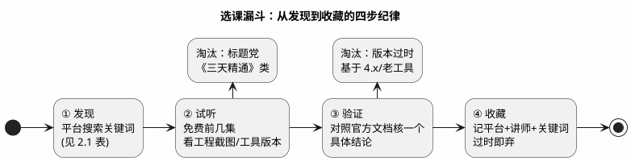

# 视频课程 00：索引——按"类型×平台"找课与选课纪律

> 一句话定位：视频课程总索引——不罗列具体课程链接（视频平台链接时效性差、且好课随平台算法沉浮），改用"课程类型 × 平台 × 搜索关键词"的方式给坐标，并给出一套"试听→验证→收藏"的选课纪律，专治标题党。
> 等级：L1 ｜ 前置：[信息食谱-如何挑选与消化资源](../00-入门导读/01-信息食谱-如何挑选与消化资源.md)

## 1. 核心概念：视频在学习路径里的正确定位

视频是"调味层"里消化成本最低的形态：适合**第一次建立画面感**（看别人配 tresos、操作 CANoe）与**补背景**（听讲师把概念串成故事），但天然不适合**沉淀细节**（无法检索、无法 diff、版本更新慢于文档）。正确姿势是"视频搭骨架 → 文档长肉 → 动手定型"——把视频当导游，不当教材。

| 课程类型 | 适合平台 | 搜索关键词（示例） | 对应本库深水区 |
|---|---|---|---|
| C 语言/嵌入式基础 | B 站、慕课平台 | C 语言 指针、嵌入式 C 进阶 | [01 区](../../01-编程语言/README.md) |
| 单片机入门（通用） | B 站、YouTube | STM32 入门、GPIO 中断 定时器 | [02 区](../../02-芯片与体系结构/README.md) |
| CAN/LIN 总线协议 | B 站、YouTube | CAN 总线 详解、CAN FD、LIN 协议 | [05 区](../../05-汽车网络通讯/README.md) |
| UDS/诊断 | B 站、YouTube | UDS 14229、OBD 诊断、DTC | [06 区](../../06-诊断与标定/README.md) |
| AUTOSAR/BSW | B 站、YouTube | AUTOSAR 入门、MCAL 配置、BSW 通讯栈 | [07 区](../../07-AUTOSAR架构/README.md)、[04 区](../../04-MCAL与外设驱动/README.md) |
| RTOS 原理 | B 站、Coursera/edX | FreeRTOS 源码、RTOS 调度 | [08 区](../../08-操作系统/README.md) |
| 工具实操 | B 站、厂商官网培训 | CANoe 教程、CAPL、tresos、S32DS | [09 区](../../09-调试与测试/README.md)、[10 区](../../10-工具链与工程化/README.md) |
| 厂商官方课 | Infineon/NXP/Vector 官网培训页 | AURIX training、S32K workshop、Vector Academy | [官方文档](../官方文档/README.md) |
| 高校公开课（计算机基础） | Coursera/edX、中国大学 MOOC | 计算机组成、操作系统 | [02 区](../../02-芯片与体系结构/README.md) |
| 功能安全/信息安全 | B 站、YouTube | 功能安全 26262 入门、ISO 21434、汽车网络安全 | [11 区](../../11-功能安全与信息安全/README.md) |
| 硬件原理图/PCB | B 站、YouTube | 原理图入门、PCB 布局、示波器使用 | [03 区](../../03-硬件基础/README.md) |
| 面试与软技能 | B 站 | 嵌入式面试、汽车电子求职、简历 | [14 区](../../14-面试与成长/README.md) |

> 上表关键词为"类型级"示例——**具体课程以平台实时搜索结果为准**，本索引刻意不固化课程链接。

## 2. 详解：三类平台的使用要领

### 2.1 资源清单表（类型×平台）

| 平台/渠道 | 是什么 | 何时用 | 挑选信号 | 替代品 |
|---|---|---|---|---|
| B 站 | 国内免费视频主阵地 | 入门中文讲解、工具实操录屏 | UP 主有工程背景、画面有真实工具截图、评论区无"求资料"刷屏 | YouTube（英文） |
| YouTube | 英文视频（含厂商官方频道） | 英文原版课、官方发布会/讲座 | 官方频道认证、播放/好评比 | B 站搬运（滞后） |
| Coursera/edX | 国际 MOOC 平台 | 系统性计算机基础课（有作业闭环） | 名校出品、有评分作业 | 中国大学 MOOC |
| 中国大学 MOOC | 国内高校公开课 | 免费985 课程补基础 | 高校官方号 | Coursera |
| 厂商官网培训 | Infineon/NXP/Vector Academy 等 | 芯片与工具的**官方**课 | 一手、随版本更新 | 第三方课（二手） |
| 付费平台专栏 | 各知识付费平台 | 进阶专栏（谨慎） | 作者公开内容有干货、可试读 | 官方文档+开源项目 |
| 厂商 Webinar | 各厂商官网活动页 | 免费在线研讨会（新品/专题，可提问） | 追新技术、直接问讲师 | 行业展会讲稿 |

### 2.2 精选点评：怎么用视频才不浪费时间

- **厂商官方课优先级高于第三方课。** Infineon 的 AURIX 培训、NXP 的 S32K workshop、Vector Academy 的 CANoe 课都是一手且随版本更新——同一主题有官方课就别先看二道贩子（入口见 [01-英飞凌](../官方文档/01-英飞凌.md)/[02-NXP](../官方文档/02-NXP.md)/[03-Vector](../官方文档/03-Vector.md)）。
- **视频要"带着问题二刷"。** 第一遍建立全景，第二遍只看与当前任务相关的章节并同步暂停实操——看配 MCAL 的课就开着 tresos 跟着点，看 CANoe 课就开着 Demo 版跟着写 CAPL。
- **倍速与截帧是刚需。** 概念性内容 1.5 倍速过，实操关键帧截屏存笔记（本区 `_images/` 正适合）——视频的信息密度低，靠截帧和笔记补。
- **收藏记"三元组"：** 平台+讲师/频道名+关键词。课程链接会因下架/改名失效，而"频道名+关键词"永远能重新搜到。
- **英文课开字幕硬听。** 官方课多为英文，开字幕硬听三个月，换来的是读英文 Release Notes/SWS 的速度红利——翻译依赖是长期负资产。
- **把看课写进周计划。** 视频学习最大的敌人是"永远在看推荐页"：固定每周 2 小时只看选定的课程序列，看完一个系列再换下一个。

## 3. 易错点与陷阱（踩坑清单）

- **坑：标题党速成课。** "三天精通 AUTOSAR""月薪 30k 速成"类课程多为 API 罗列+画饼。**对策：** 认准试听环节——10 分钟内没有出现真实工具界面（tresos/CANoe/示波器）直接关。
- **坑：课程基于过时版本。** 讲 4.x 时代 AUTOSAR 或老版本 S32DS/tresos，操作路径对不上现状。**对策：** 看发布时间与工具版本号；超过 3 年的实操课默认要"翻译"一遍再做。
- **坑：盗版搬运课画质/内容双损。** 搬运视频常缺附件工程与答疑。**对策：** 免费内容看正版渠道；付费课要么买正版要么不学，别在盗版上浪费最贵的时间。
- **坑：只看不动手，产生"我会了"的错觉。** 视频的致命陷阱——看别人配 tresos 很顺，自己上手全卡住。**对策：** 每看完一个实操章节，强制在自己的板子/工具上复现一遍（练手清单见 [12 区练手项目](../../12-项目实战/1-L1基础/练手项目/README.md)）。
- **坑：用视频替代文档。** 视频不可检索，做细节查证效率极低。**对策：** 定位分清——视频管"入门与全景"，文档管"查证与细节"，面试/工作里能引用的永远是文档与实操，不是"我看过某课"。

## 4. 面试高频题

**Q：你怎么系统学习一个新领域（比如 AUTOSAR）？视频、文档、书怎么排优先级？**

答：视频先行建立全景（1~2 套入门课，倍速）→ 官方文档/标准长细节（SWS+工具手册，三遍法）→ 书补体系化框架 → 全程配练手项目定型。视频只负责"画面感"，能被面试官追问时引用的结论都来自文档与实操。

**Q：为什么说"我看过某课程"在面试里没有说服力？怎么把看课转化为说服力？**

答：视频是被动的、不可验证的；说服力来自产出——把课程内容落成练手项目、笔记（带截帧）、或解决了具体问题的记录。面试讲"我照着原理做了 X，遇到 Y 问题，查 Z 文档解决"远胜课程名罗列。

**Q：新同事要入门 CAN 总线，你会推荐什么学习路径？**

答：一天 CSS Electronics 图解教程（或本库 [05 区导读](../../05-汽车网络通讯/00-入门导读/README.md)）建立全景 → 跟一个 B 站实操课用 SavvyCAN/Busmaster 抓真实报文 → 精读帧格式/位时序文档章节 → 最后在板子上跑通收发（[12 区 CAN 裸驱练手](../../12-项目实战/1-L1基础/练手项目/03-CAN裸驱收发.md)）。视频占比不超过 20%。

## 5. 延伸

- [信息食谱](../00-入门导读/01-信息食谱-如何挑选与消化资源.md)：视频在四层食谱里的份额与定位依据；
- [官方文档](../官方文档/README.md)：厂商官方培训课的入口（Infineon/NXP/Vector）；
- [优质博客与网站索引](../优质博客与网站/00-索引.md)：同属调味层的文字形态；
- [12 区练手项目](../../12-项目实战/1-L1基础/练手项目/README.md)：把看课转化为动手产出的阶梯；
- [开源项目索引](../开源项目/00-索引.md)：无 License 时跟课实操的替代工具；
- [11 区功能安全](../../11-功能安全与信息安全/README.md)：26262/21434 类课程对应的深水笔记。

---

维护约定：笔记命名 `序号-主题.md`；真实截图放 `_images/`；流程/时序/状态/架构图用 PlantUML 内嵌正文，规范见 [图表规范与模板](../../00-总览/图表规范与模板.md)。
